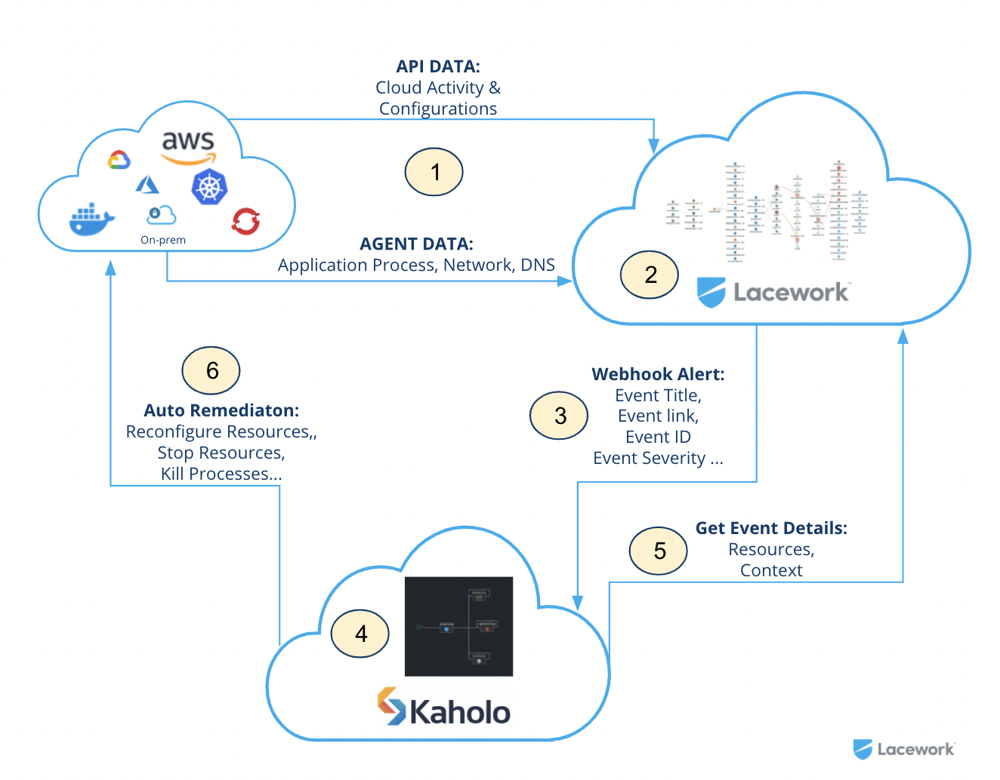
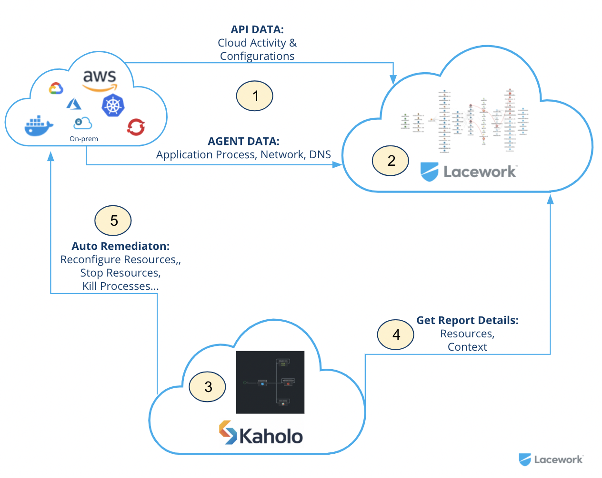

# lacework-kaholo-autoremediation

This repository is a collection of [Kaholo.io](https://www.kaholo.io) maps you can use as examples to automate the remediation of [Lacework](https://www.lacework.com/) events and compliance reports.

## What is Auto Remediation?
Auto remediation is the idea to automate the responds to events and alerts with automated steps that are able to fix, or remediate underlying conditions and misconfigurations without the need of interaction from anyone. Auto remediation itself can  trigger a CLI command, a serverless function, a terraform run or an API call to remediate Alerts detected by Lacework. Automation of Remediation can be easy or complex depending on the alert and context correlated with the necessary remediation steps.

## Why should i use auto remediation?
We live in a complex world of Multi Cloud Environments. Cloud itself isn't as easy as it was sold to us. With the adoption of cloud and cloud native applications and using modern technology like Kubernetes, Container and Serverless applications you automatically adopt endless complexity with many potential security risks. All of the services need to fulfill your security and compliance regulations. Your personal target should be to secure as much and as best as possible, independent of the industry and compliance regulations you need to fulfill.

Auto remediation means to automate the necessary steps of alert events detected by Lacework without any human interaction. Auto Remediation can partially or fully help to fix specific alerts.

Simplified you can say: "The more is automated, the faster you can react to alerts and the more time you safe for doing any manual interactions". Time is money and in security it means a risk you take while the alert is not solved. The **MTTR** (**M**ean **T**ime **t**o **R**ecover or **R**estore) should be as fast as possible to not take any risks for a long time in case of an alert. A misconfiguration or bad behaviour of your application(s) can lead to outages, stolen customer data and a headline story of your company in the newspaper.

## Why Lacework and Kaholo?
Lacework and Kaholo is a perfect match!

Lacework itself is using Data ware house technology (Snowflake) and Machine Learning technology to reduce the number of false positive events and create high quality alerts (events). These events, alerts and compliance reports from Lacework in general have a lot of high quality context information included that can be used to automate the necessary remediation steps.

Kaholo is an easy and intuitive workflow engine that makes it easy to create almost any automation processes, including advanced ones. On top of that you get central visibility into all automation processes called Kaholo Maps. Instead of simply triggering a single CLI command or single API calls and serverless functions it allows the creation of complex workflows that might be necessary for specific auto remediation steps.

## How does it work?
We did create two Kaholo Plugins to enable the Integration between Lacework and Kaholo:

1. The [Lacework Trigger Plugin](https://github.com/Kaholo/kaholo-trigger-lacework) that enables Kaholo to listen to Lacework specific Webhook Alerts and doing the pre filtering and selection of what map needs to be triggered inside Kaholo based on the Information send by the [Lacework Webhook channel](https://support.lacework.com/hc/en-us/articles/360034367393-Webhook). The Webhook configuration that is important to decide for the plugin which map to trigger can be set in each map.

2. The [Lacework Plugin](https://github.com/Kaholo/kaholo-plugin-lacework) that enables Kaholo users to Get Details about Events send by the [Lacework Webhook channel](https://support.lacework.com/hc/en-us/articles/360034367393-Webhook) and also enables Kaholo users to get Compliance Report details for remediation.

With that two plugins the following integration examples are possible.

### Auto Remediation via Webhook alerts



1. The Lacework Platform is collecting the necessary Cloud and Workload Data.
2. The Lacework Machine Learning algorithms learn the normal behaviour of cloud user and workload activity by using the Polygraph technology and comparing cloud resources against compliance frameworks.
3. In case of an Alert Lacework sends the necessary event details via the [Webhook Alert channel](https://support.lacework.com/hc/en-us/articles/360034367393-Webhook).
4. The Kaholo [Lacework Trigger](https://github.com/Kaholo/kaholo-trigger-lacework) is reading out the **event_source** and **event_description** of the event. Every Kaholo Map is configured to check the **event_source** and the **event_description** if it includes specific information that is relevant to trigger a specific Kaholo Map.
5. The Kaholo Map triggered is reading out the specific Event Data and Context by using the Method **"Get event details"** of the [Lacework Plugin](https://github.com/Kaholo/kaholo-plugin-lacework). This data can be used within the map triggered.
6. The Kaholo Map is doing all the necessary Auto Remediation steps by using the CLI commands of the cloud providers and Kaholo objects.

### Auto Remediation via Compliance reports



1. The Lacework Platform is collecting the necessary Cloud and Workload Data.
2. The Lacework Machine Learning algorithms learn the normal behaviour of cloud user and workload activity by using the Polygraph technology and comparing cloud resources against compliance frameworks.
3. A Kaholo user can trigger any of the Kaholo Maps that is using the [Lacework Plugin](https://github.com/Kaholo/kaholo-plugin-lacework) at any time or scheduled within Kaholo.
4. The Kaholo [Lacework Trigger](https://github.com/Kaholo/kaholo-trigger-lacework) is reading out the Report Data via the Method **GetLatestAWSComplianceReportDetails** that allows to collect the latest Compliance Report for a specific AWS account id. It supports to get all the details of the latest compliance reports for:
* AWS NIST 800-171 Report
* NIST_800-171_Rev2
* AWS NIST 800-53 Report
* AWS HIPAA Report
* AWS SOC 2 Report
* AWS PCI DSS Reportd
5. The Kaholo Map is using the information about the compliance report doing all the necessary Auto Remediation steps for the specific map by using the CLI commands of the cloud providers and Kaholo objects.

## How to start?

First of all you need to have a Lacework and Kaholo instance. For Lacework support please contact us [here](https://info.lacework.com/contact) and the Kaholo team is available [here](https://kaholo.io/signup/). Lacework is a Saas offering only. Kaholo can be used On Premise or as Saas deployment.

1. First step is to setup the [Webhook channel](https://support.lacework.com/hc/en-us/articles/360034367393-Webhook) inside Lacework to forward Alerts to Kaholo.
2. Inside the Kaholo instance you need to install the Kaholo [Lacework Trigger](https://github.com/Kaholo/kaholo-trigger-lacework/tree/ilanyaniv-patch-1) and the [Lacework Plugin](https://github.com/Kaholo/kaholo-plugin-lacework).
3. The Kaholo Plugin itself needs to be configured with:
* [Lacework API Key](https://support.lacework.com/hc/en-us/articles/360011403853-Generate-API-Access-Keys-and-Tokens) (Saved inside the Kaholo Vault)
* [Lacework Secret Key](https://support.lacework.com/hc/en-us/articles/360011403853-Generate-API-Access-Keys-and-Tokens) (Saved inside the Kaholo Vault)
* Lacework Instance in format MYINSTANCE if your instance in Lacework is https://MYINSTANCE.lacework.net
4. Create a new Project inside Kaholo (example Lacework - AutoRemediation) as collection for the different auto remediation maps.
5. Start to import the necessary maps from the maps available.

### Creating your Kaholo Agent with Cloud Provider CLIs included.

To be able to execute the Cloud Provider AutoRemediation CLI commands you need to create a new agent container image that can be used to connect to your central Kaholo instance and trigger the playbooks.

1. We recommend to clone the current Kaholo Agent repository available at https://github.com/Kaholo/kaholo-agent
2. You need to update the Dockerfile by adding the installation instructions to install the Cloud Provider specific CLI. Currently we do focus on AWS, but we will add the other cloud provider CLIs in the future.

Dockerfile
```
FROM node:14.15.2-buster

# Create app directory
WORKDIR /usr/src/app

COPY package*.json ./

RUN npm install --production

# Bundle app source
COPY . .

RUN curl "https://awscli.amazonaws.com/awscli-exe-linux-x86_64.zip" -o "awscliv2.zip" && unzip awscliv2.zip && ./aws/install

EXPOSE 8090

CMD [ "npm", "start" ]
```

3. Make sure that you map the necessary credentials, environment files and configuration into the Agent container. The Kaholo customer success team will help you to map the necessary config files similar to the following approach described at https://docs.aws.amazon.com/cli/latest/userguide/install-cliv2-docker.html.

## Which Maps are already available?

This repository is a community project. Everyone interested can contribute and update existing and creating new maps. Currently the following Maps are available

### Compliance

#### AWS
Map ID | Description | Status | CLI Remediation | Plugin Remediation
--- | --- | --- | --- | ---
LW_S3_1 | Ensure the S3 bucket ACL does not grant 'Everyone' READ permission [list S3 objects] | [Implemented](maps/compliance/aws/LW_S3_1/README.md) | yes | yes
LW_S3_2 | Ensure the S3 bucket ACL does not grant 'Everyone' WRITE permission [create, overwrite, and delete S3 objects] | [Implemented](maps/compliance/aws/LW_S3_2/README.md) | yes | yes
LW_S3_3 | Ensure the S3 bucket ACL does not grant 'Everyone' READ_ACP permission [read bucket ACL] | [Implemented](maps/compliance/aws/LW_S3_3/README.md) | yes | yes
LW_S3_4 | Ensure the S3 bucket ACL does not grant 'Everyone' WRITE_ACP permission [modify bucket ACL] | [Implemented](maps/compliance/aws/LW_S3_4/README.md) | yes | yes
LW_S3_5 | Ensure the S3 bucket ACL does not grant 'Everyone' FULL_CONTROL [READ, WRITE, READ_ACP, WRITE_ACP] | [Implemented](maps/compliance/aws/LW_S3_5/README.md) | yes | yes
LW_S3_6 | Ensure the S3 bucket ACL does not grant AWS users READ permission [list S3 objects] | [Implemented](maps/compliance/aws/LW_S3_6/README.md) | yes | yes
LW_S3_7 | Ensure the S3 bucket ACL does not grant AWS users WRITE permission [create, overwrite, and delete S3 objects] | [Implemented](maps/compliance/aws/LW_S3_7/README.md) | yes | yes
LW_S3_8 | Ensure the S3 bucket ACL does not grant AWS users READ_ACP permission [read bucket ACL] | [Implemented](maps/compliance/aws/LW_S3_8/README.md) | yes | yes
LW_S3_9 | Ensure the S3 bucket ACL does not grant AWS users WRITE_ACP permission [modify bucket ACL] | [Implemented](maps/compliance/aws/LW_S3_9/README.md) | yes | yes
LW_S3_10 | Ensure the S3 bucket ACL does not grant AWS users FULL_CONTROL [READ, WRITE, READ_ACP, WRITE_ACP] | [Implemented](maps/compliance/aws/LW_S3_10/README.md) | yes | yes
LW_S3_11 | Ensure the attached S3 bucket policy does not grant 'Allow' permission to everyone | [Implemented](maps/compliance/aws/LW_S3_11/README.md) | yes | yes
LW_S3_12 | Ensure the S3 bucket requires MFA to delete objects | [Prototype](maps/compliance/aws/LW_S3_12/README.md) | yes | yes
LW_S3_13 | Ensure the S3 bucket has access logging enabled | [Implemented](maps/compliance/aws/LW_S3_13/README.md) | yes | yes
LW_S3_14 | Ensure all data stored in the S3 bucket is securely encrypted at rest | [Implemented](maps/compliance/aws/LW_S3_14/README.md) | yes | yes
LW_S3_15 | Ensure all data is transported from the S3 bucket securely | [Implemented](maps/compliance/aws/LW_S3_15/README.md) | yes | yes
LW_S3_16 | Ensure the S3 bucket has versioning enabled | [Implemented](maps/compliance/aws/LW_S3_16/README.md) | yes | yes
LW_S3_17 | Ensure the S3 bucket access is restricted to a whitelist of IP networks. | [Prototype](maps/compliance/aws/LW_S3_17/README.md) | yes | yes
LW_S3_18 | Ensure the attached S3 bucket policy does not grant global 'Get' permission. | [Implemented](maps/compliance/aws/LW_S3_18/README.md) |yes | yes
LW_S3_19 | Ensure the attached S3 bucket policy does not grant global 'Delete' permission. | [Implemented](maps/compliance/aws/LW_S3_19/README.md) | yes | yes
LW_S3_20 | Ensure the attached S3 bucket policy does not grant global 'List' permission. | [Implemented](maps/compliance/aws/LW_S3_20/README.md) | yes | yes
LW_S3_21 | Ensure the attached S3 bucket policy does not grant global 'Put' permission. | [Implemented](maps/compliance/aws/LW_S3_21/README.md) | yes | yes
AWS_CIS_1_1 | Avoid the use of the "root" account | [not implemented](maps/compliance/aws/AWS_CIS_1_1/README.md) | no | no
AWS_CIS_1_2 | Ensure multi-factor authentication (MFA) is enabled for all IAM users that have a console password | [not implemented](maps/compliance/aws/AWS_CIS_1_2/README.md) | no | no
AWS_CIS_1_3 | Ensure credentials unused for 90 days or greater are disabled | [not implemented](maps/compliance/aws/AWS_CIS_1_3/README.md) | no | no
AWS_CIS_1_4 | Ensure access keys are rotated every 90 days or less | [not implemented](maps/compliance/aws/AWS_CIS_1_4/README.md) | no | no
AWS_CIS_1_5 | Ensure IAM password policy requires at least one uppercase letter | [not implemented](maps/compliance/aws/AWS_CIS_1_5/README.md) | no | no
AWS_CIS_1_6 | Ensure IAM password policy require at least one lowercase letter | [not implemented](maps/compliance/aws/AWS_CIS_1_6/README.md) | no | no
AWS_CIS_1_7 | Ensure IAM password policy require at least one symbol | [not implemented](maps/compliance/aws/AWS_CIS_1_7/README.md) | no | no
AWS_CIS_1_8 | Ensure IAM password policy require at least one number | [not implemented](maps/compliance/aws/AWS_CIS_1_8/README.md) | no | no
AWS_CIS_1_9 | Ensure IAM password policy requires minimum length of 14 or greater | [not implemented](maps/compliance/aws/AWS_CIS_1_9/README.md) | no | no
AWS_CIS_1_10 | Ensure IAM password policy prevents password reuse | [not implemented](maps/compliance/aws/AWS_CIS_1_10/README.md) | no | no
AWS_CIS_1_11 | Ensure IAM password policy expires passwords within 90 days or less | [not implemented](maps/compliance/aws/AWS_CIS_1_11/README.md) | no | no
AWS_CIS_1_12 | Ensure no root account access key exists | [not implemented](maps/compliance/aws/AWS_CIS_1_12/README.md) | no | no
AWS_CIS_1_13 | Ensure MFA is enabled for the "root" account | [not implemented](maps/compliance/aws/AWS_CIS_1_13/README.md) | no | no
AWS_CIS_1_14 | Ensure hardware MFA is enabled for the "root" account | [not implemented](maps/compliance/aws/AWS_CIS_1_14/README.md) | no | no
AWS_CIS_1_15 | Ensure security questions are registered in the AWS account | [not implemented](maps/compliance/aws/AWS_CIS_1_15/README.md) | no | no
AWS_CIS_1_16 | Ensure IAM policies are attached only to groups or roles | [not implemented](maps/compliance/aws/AWS_CIS_1_16/README.md) | no | no
AWS_CIS_1_17 | Enable detailed billing | [not implemented](maps/compliance/aws/AWS_CIS_1_17/README.md) | no | no
AWS_CIS_1_19 | Maintain current contact details | [not implemented](maps/compliance/aws/AWS_CIS_1_19/README.md) | no | no
AWS_CIS_1_20 | Ensure security contact information is registered | [not implemented](maps/compliance/aws/AWS_CIS_1_20/README.md) | no | no
AWS_CIS_1_21 | Ensure IAM instance roles are used for AWS resource access from instances | [not implemented](maps/compliance/aws/AWS_CIS_1_21/README.md) | no | no
AWS_CIS_1_22 | Ensure a support role has been created to manage incidents with AWS Support | [not implemented](maps/compliance/aws/AWS_CIS_1_22/README.md) | no | no
AWS_CIS_1_23 | Do not setup access keys during initial user setup for all IAM users that have a console password | [not implemented](maps/compliance/aws/AWS_CIS_1_23/README.md) | no | no
AWS_CIS_1_24 | Ensure IAM policies that allow full "*:*" administrative privileges are not created | [not implemented](maps/compliance/aws/AWS_CIS_1_24/README.md) | no | no
LW_AWS_IAM_1 | Ensure access keys are rotated every 30 days or less | [not implemented](maps/compliance/aws/LW_AWS_IAM_1/README.md) | no | no
LW_AWS_IAM_2 | Ensure access keys are rotated every 45 days or less | [not implemented](maps/compliance/aws/LW_AWS_IAM_2/README.md) | no | no
LW_AWS_IAM_3 | Ensure public ssh keys are rotated every 30 days or less | [not implemented](maps/compliance/aws/LW_AWS_IAM_3/README.md) | no | no
LW_AWS_IAM_4 | Ensure public ssh keys are rotated every 45 days or less | [not implemented](maps/compliance/aws/LW_AWS_IAM_4/README.md) | no | no
LW_AWS_IAM_5 | Ensure public ssh keys are rotated every 90 days or less | [not implemented](maps/compliance/aws/LW_AWS_IAM_5/README.md) | no | no
LW_AWS_IAM_6 | Ensure active access keys are used every 90 days or less | [not implemented](maps/compliance/aws/LW_AWS_IAM_6/README.md) | no | no
LW_AWS_IAM_7 | Iam user should not be inactive from last 30 days or more | [not implemented](maps/compliance/aws/LW_AWS_IAM_7/README.md) | no | no
LW_AWS_IAM_8 | Ensure IAM configuration has valid Identity Providers configuration | [not implemented](maps/compliance/aws/LW_AWS_IAM_8/README.md) | no | no
LW_AWS_IAM_9 | Ensure IAM Role restrict access to a list of whitelist of IP networks | [not implemented](maps/compliance/aws/LW_AWS_IAM_9/README.md) | no | no
LW_AWS_IAM_10 | Ensure IAM User restrict access to a list of whitelist of IP networks | [not implemented](maps/compliance/aws/LW_AWS_IAM_10/README.md) | no | no
LW_AWS_IAM_11 | Ensure non-root user exists in the account | [not implemented](maps/compliance/aws/LW_AWS_IAM_11/README.md) | no | no
LW_AWS_IAM_12 | Ensure access keys are rotated every 350 days or less | [not implemented](maps/compliance/aws/LW_AWS_IAM_12/README.md) | no | no
LW_AWS_IAM_13 | Ensure access keys are rotated every 180 days or less | [not implemented](maps/compliance/aws/LW_AWS_IAM_13/README.md) | no | no
LW_AWS_IAM_14 | No IAM users with password-based console access should exist | [not implemented](maps/compliance/aws/LW_AWS_IAM_14/README.md) | no | no
AWS_CIS_2_1 | Ensure CloudTrail is enabled in all regions | [not implemented](maps/compliance/aws/AWS_CIS_2_1/README.md) | no | no
AWS_CIS_2_2 | Ensure CloudTrail log file validation is enabled | [not implemented](maps/compliance/aws/AWS_CIS_2_2/README.md) | no | no
AWS_CIS_2_3 | Ensure S3 bucket CloudTrail logs is not publicly accessible | [not implemented](maps/compliance/aws/AWS_CIS_2_2/README.md) | no | no
AWS_CIS_2_4 | Ensure CloudTrail is integrated with CloudWatch Logs | [not implemented](maps/compliance/aws/AWS_CIS_2_4/README.md) | no | no
AWS_CIS_2_5 | Ensure AWS Config is enabled in all regions | [not implemented](maps/compliance/aws/AWS_CIS_2_5/README.md) | no | no
AWS_CIS_2_6 | Ensure S3 bucket access logging is enabled on the CloudTrail S3 bucket | [not implemented](maps/compliance/aws/AWS_CIS_2_6/README.md) | no | no
AWS_CIS_2_7 | Ensure CloudTrail logs are encrypted at rest using KMS CMKs | [not implemented](maps/compliance/aws/AWS_CIS_2_7/README.md) | no | no
AWS_CIS_2_8 | Ensure rotation for customer created CMKs is enabled | [not implemented](maps/compliance/aws/AWS_CIS_2_8/README.md) | no | no
AWS_CIS_2_9 | Ensure Flow Logging for VPC is enabled and active | [not implemented](maps/compliance/aws/AWS_CIS_2_9/README.md) | no | no
AWS_CIS_3_2 | Ensure a log metric filter and alarm exist for Management Console sign-in without MFA | [not implemented](maps/compliance/aws/AWS_CIS_3_2/README.md) | no | no
AWS_CIS_3_3 | Ensure a log metric filter and alarm exist for usage of "root" account | [not implemented](maps/compliance/aws/AWS_CIS_3_2/README.md) | no | no
AWS_CIS_3_4 | Ensure a log metric filter and alarm exist for IAM policy changes | [not implemented](maps/compliance/aws/AWS_CIS_3_4/README.md) | no | no
AWS_CIS_3_5 | Ensure a log metric filter and alarm exist for CloudTrail configuration changes | [not implemented](maps/compliance/aws/AWS_CIS_3_5/README.md) | no | no
AWS_CIS_3_6 | Ensure a log metric filter and alarm exist for AWS Management Console authentication failures | [not implemented](maps/compliance/aws/AWS_CIS_3_6/README.md) | no | no
AWS_CIS_3_7 | Ensure a log metric filter and alarm exist for disabling or scheduled deletion of customer created CMKs | [not implemented](maps/compliance/aws/AWS_CIS_3_7/README.md) | no | no
AWS_CIS_3_8 | Ensure a log metric filter and alarm exist for S3 bucket policy changes | [not implemented](maps/compliance/aws/AWS_CIS_3_8/README.md) | no | no
AWS_CIS_3_9 | Ensure a log metric filter and alarm exist for AWS Config configuration changes | [not implemented](maps/compliance/aws/AWS_CIS_3_9/README.md) | no | no
AWS_CIS_3_10 | Ensure a log metric filter and alarm exist for security group changes | [not implemented](maps/compliance/aws/AWS_CIS_3_10/README.md) | no | no
AWS_CIS_3_11 | Ensure a log metric filter and alarm exist for changes to Network Access Control Lists (NACL) | [not implemented](maps/compliance/aws/AWS_CIS_3_11/README.md) | no | no
AWS_CIS_3_12 | Ensure a log metric filter and alarm exist for changes to network gateways | [not implemented](maps/compliance/aws/AWS_CIS_3_12/README.md) | no | no
AWS_CIS_3_13 | Ensure a log metric filter and alarm exist for route table changes | [not implemented](maps/compliance/aws/AWS_CIS_3_13/README.md) | no | no
AWS_CIS_3_14 | Ensure a log metric filter and alarm exist for VPC changes | [not implemented](maps/compliance/aws/AWS_CIS_3_14/README.md) | no | no
AWS_CIS_3_15 | Ensure appropriate subscribers to each SNS topic | [not implemented](maps/compliance/aws/AWS_CIS_3_15/README.md) | no | no
AWS_CIS_4_1 | Ensure no security groups allow ingress from 0.0.0.0/0 to port 22 | [not implemented](maps/compliance/aws/AWS_CIS_4_1/README.md) | no | no
AWS_CIS_4_2 | Ensure no security groups allow ingress from 0.0.0.0/0 to port 3389 | [not implemented](maps/compliance/aws/AWS_CIS_4_2/README.md) | no | no
AWS_CIS_4_4 | Ensure the default security group of every VPC restricts all traffic | [not implemented](maps/compliance/aws/AWS_CIS_4_4/README.md) | no | no
AWS_CIS_4_5 | Ensure routing tables for VPC peering are "least access" | [not implemented](maps/compliance/aws/AWS_CIS_4_5/README.md) | no | no
LW_AWS_MONGODB_1 | Security group attached to EC2 instance should not allow inbound traffic from all to TCP port 27017 (MongoDB) | [not implemented](maps/compliance/aws/LW_AWS_MONGODB_1/README.md) | no | no
LW_AWS_MONGODB_2 | Security group attached to EC2 instance should not allow inbound traffic from all to TCP port 27018 (MongoDB) | [not implemented](maps/compliance/aws/LW_AWS_MONGODB_2/README.md) | no | no
LW_AWS_MONGODB_3 | Security group attached to Elastic Load Balancer instance should not allow inbound traffic from all to TCP port 27017 (MongoDB) | [not implemented](maps/compliance/aws/LW_AWS_MONGODB_3/README.md) | no | no
LW_AWS_MONGODB_4 | Security group attached to Elastic Load Balancer instance should not allow inbound traffic from all to TCP port 27018 (MongoDB) | [not implemented](maps/compliance/aws/LW_AWS_MONGODB_4/README.md) | no | no
LW_AWS_MONGODB_5 | Security group attached to Application Load Balancer instance should not allow inbound traffic from all to TCP port 27017 (MongoDB) | [not implemented](maps/compliance/aws/LW_AWS_MONGODB_5/README.md) | no | no
LW_AWS_MONGODB_6 | Security group attached to Application Load Balancer instance should not allow inbound traffic from all to TCP port 27018 (MongoDB) | [not implemented](maps/compliance/aws/LW_AWS_MONGODB_6/README.md) | no | no
LW_AWS_NETWORKING_1 | Security groups are not attached to the EC2 instance | [not implemented](maps/compliance/aws/LW_AWS_NETWORKING_1/README.md) | no | no
LW_AWS_NETWORKING_2 | Network ACLs do not allow unrestricted inbound traffic | [not implemented](maps/compliance/aws/LW_AWS_NETWORKING_2/README.md) | no | no
LW_AWS_NETWORKING_3 | Network ACLs do not allow unrestricted outbound traffic | [not implemented](maps/compliance/aws/LW_AWS_NETWORKING_3/README.md) | no | no
LW_AWS_NETWORKING_4 | AWS VPC endpoints should not be exposed | [not implemented](maps/compliance/aws/LW_AWS_NETWORKING_4/README.md) | no | no
LW_AWS_NETWORKING_5 | Security Group should not be open to all(unrestricted) | [not implemented](maps/compliance/aws/LW_AWS_NETWORKING_5/README.md) | no | no
LW_AWS_NETWORKING_6 | Security Group should not accept traffic other than 80 and 443 | [not implemented](maps/compliance/aws/LW_AWS_NETWORKING_6/README.md) | no | no
LW_AWS_NETWORKING_7 | Unrestricted Security Group should not be attached to EC2 instance | [not implemented](maps/compliance/aws/LW_AWS_NETWORKING_7/README.md) | no | no
LW_AWS_NETWORKING_8 | Unrestricted Security Group should not be attached to RDS database | [not implemented](maps/compliance/aws/LW_AWS_NETWORKING_8/README.md) | no | no
LW_AWS_NETWORKING_9 | Unrestricted Security Group should not be attached to Network Interface | [not implemented](maps/compliance/aws/LW_AWS_NETWORKING_9/README.md) | no | no
LW_AWS_NETWORKING_10 | Unrestricted Security Group should not be attached to Classical Load Balancer | [not implemented](maps/compliance/aws/LW_AWS_NETWORKING_10/README.md) | no | no
LW_AWS_NETWORKING_11 | Unrestricted Security Group should not be attached to Application Load Balancer | [not implemented](maps/compliance/aws/LW_AWS_NETWORKING_11/README.md) | no | no
LW_AWS_NETWORKING_12 | Security group attached to EC2 instance should not allow inbound traffic from all to TCP port 9300 (Elasticsearch) | [not implemented](maps/compliance/aws/LW_AWS_NETWORKING_12/README.md) | no | no
LW_AWS_NETWORKING_13 | Security group attached to EC2 instance should not allow inbound traffic from all to TCP port 5601 (Kibana) | [not implemented](maps/compliance/aws/LW_AWS_NETWORKING_13/README.md) | no | no
LW_AWS_NETWORKING_14 | Security group attached to EC2 instance should not allow inbound traffic from all to TCP port 6379 (Redis) | [not implemented](maps/compliance/aws/LW_AWS_NETWORKING_14/README.md) | no | no
LW_AWS_NETWORKING_15 | Security group attached to EC2 instance should not allow inbound traffic from all to TCP port 2379 (etcd) | [not implemented](maps/compliance/aws/LW_AWS_NETWORKING_15/README.md) | no | no
LW_AWS_NETWORKING_16 | ELB SSL Certificate expires in 5 Days | [not implemented](maps/compliance/aws/LW_AWS_NETWORKING_16/README.md) | no | no
LW_AWS_NETWORKING_17 | ELB SSL Certificate expires in 45 Days | [not implemented](maps/compliance/aws/LW_AWS_NETWORKING_17/README.md) | no | no
LW_AWS_NETWORKING_18 | Security group attached to EC2 instance should not allow inbound traffic from all to TCP port 23 (Telnet) | [not implemented](maps/compliance/aws/LW_AWS_NETWORKING_18/README.md) | no | no
LW_AWS_NETWORKING_19 | Security group attached to EC2 instance should not allow inbound traffic from all to TCP port 135 (Windows RPC) | [not implemented](maps/compliance/aws/LW_AWS_NETWORKING_19/README.md) | no | no
LW_AWS_NETWORKING_20 | Security group attached to EC2 instance should not allow inbound traffic from all to TCP port 445 (Windows SMB) | [not implemented](maps/compliance/aws/LW_AWS_NETWORKING_20/README.md) | no | no
LW_AWS_NETWORKING_21 | Security group attached to EC2 instance should not allow inbound traffic from all to TCP port 3306 (MySQL) | [not implemented](maps/compliance/aws/LW_AWS_NETWORKING_21/README.md) | no | no
LW_AWS_NETWORKING_22 | Security group attached to EC2 instance should not allow inbound traffic from all to TCP port 5432 (PostgreSQL) | [not implemented](maps/compliance/aws/LW_AWS_NETWORKING_22/README.md) | no | no
LW_AWS_NETWORKING_23 | Security group attached to EC2 instance should not allow inbound traffic from all to TCP port 1433 (SQLServer) | [not implemented](maps/compliance/aws/LW_AWS_NETWORKING_23/README.md) | no | no
LW_AWS_NETWORKING_24 | Security group attached to EC2 instance should not allow inbound traffic from all to UDP port 1434 (SQLServer) | [not implemented](maps/compliance/aws/LW_AWS_NETWORKING_24/README.md) | no | no
LW_AWS_NETWORKING_25 | Security group attached to EC2 instance should not allow inbound traffic from all to TCP port 4333 (MSQL) | [not implemented](maps/compliance/aws/LW_AWS_NETWORKING_25/README.md) | no | no
LW_AWS_NETWORKING_26 | Security group attached to EC2 instance should not allow inbound traffic from all to TCP port 5500 (VNC Listener) | [not implemented](maps/compliance/aws/LW_AWS_NETWORKING_26/README.md) | no | no
LW_AWS_NETWORKING_27 | Security group attached to EC2 instance should not allow inbound traffic from all to TCP port 5900 (VNC Server) | [not implemented](maps/compliance/aws/LW_AWS_NETWORKING_27/README.md) | no | no
LW_AWS_NETWORKING_28 | Security group attached to EC2 instance should not allow inbound traffic from all to UDP port 137 (NetBIOS) | [not implemented](maps/compliance/aws/LW_AWS_NETWORKING_28/README.md) | no | no
LW_AWS_NETWORKING_29 | Security group attached to EC2 instance should not allow inbound traffic from all to UDP port 138 (NetBIOS) | [not implemented](maps/compliance/aws/LW_AWS_NETWORKING_29/README.md) | no | no
LW_AWS_NETWORKING_30 | Security group attached to EC2 instance should not allow inbound traffic from all to UDP port 445 (CIFS) | [not implemented](maps/compliance/aws/LW_AWS_NETWORKING_30/README.md) | no | no
LW_AWS_NETWORKING_31 | Security group attached to EC2 instance should not allow inbound traffic from all to TCP port 21 (FTP) | [not implemented](maps/compliance/aws/LW_AWS_NETWORKING_31/README.md) | no | no
LW_AWS_NETWORKING_32 | Security group attached to EC2 instance should not allow inbound traffic from all to TCP port 20 (FTP-Data) | [not implemented](maps/compliance/aws/LW_AWS_NETWORKING_32/README.md) | no | no
LW_AWS_NETWORKING_33 | Security group attached to EC2 instance should not allow inbound traffic from all to TCP port 25 (SMTP) | [not implemented](maps/compliance/aws/LW_AWS_NETWORKING_33/README.md) | no | no
LW_AWS_NETWORKING_34 | Security group attached to EC2 instance should not allow inbound traffic from all to TCP port 53 (DNS) | [not implemented](maps/compliance/aws/LW_AWS_NETWORKING_34/README.md) | no | no
LW_AWS_NETWORKING_35 | Security group attached to EC2 instance should not allow inbound traffic from all to UDP port 53 (DNS) | [not implemented](maps/compliance/aws/LW_AWS_NETWORKING_35/README.md) | no | no
LW_AWS_NETWORKING_36 | Security group attached to EC2 instance should not allow inbound traffic from all to All Ports | [not implemented](maps/compliance/aws/LW_AWS_NETWORKING_36/README.md) | no | no
LW_AWS_NETWORKING_37 | Redshift Cluster should not be Publicly Accessible | [not implemented](maps/compliance/aws/LW_AWS_NETWORKING_37/README.md) | no | no
LW_AWS_NETWORKING_38 | ELB Security Group should have Outbound Rules attached to it | [not implemented](maps/compliance/aws/LW_AWS_NETWORKING_38/README.md) | no | no
LW_AWS_NETWORKING_39 | ELB should not use insecure Cipher(s) | [not implemented](maps/compliance/aws/LW_AWS_NETWORKING_39/README.md) | no | no
LW_AWS_NETWORKING_40 | EC2 instance should be deployed in EC2-VPC platform | [not implemented](maps/compliance/aws/LW_AWS_NETWORKING_40/README.md) | no | no
LW_AWS_NETWORKING_41 | CloudFront Origin Protocol Policy should use https-only | [not implemented](maps/compliance/aws/LW_AWS_NETWORKING_41/README.md) | no | no
LW_AWS_NETWORKING_42 | CloudFront Origin SSL Protocols should not use insecure Cipher(s) | [not implemented](maps/compliance/aws/LW_AWS_NETWORKING_42/README.md) | no | no
LW_AWS_NETWORKING_43 | Security group should not allow inbound traffic from all to all ICMP | [not implemented](maps/compliance/aws/LW_AWS_NETWORKING_43/README.md) | no | no
LW_AWS_NETWORKING_44 | ELB should have VPC ingress security group | [not implemented](maps/compliance/aws/LW_AWS_NETWORKING_44/README.md) | no | no
LW_AWS_NETWORKING_45 | ELB should have valid and secure security group | [not implemented](maps/compliance/aws/LW_AWS_NETWORKING_45/README.md) | no | no
LW_AWS_NETWORKING_46 | No Default VPC should be present in an AWS account | [not implemented](maps/compliance/aws/LW_AWS_NETWORKING_46/README.md) | no | no
LW_AWS_NETWORKING_47 | EC2 instances should not have a Public IP address attached | [not implemented](maps/compliance/aws/LW_AWS_NETWORKING_47/README.md) | no | no
LW_AWS_NETWORKING_48 | Attached VPC CIDR block(s) should be in whitelist | [not implemented](maps/compliance/aws/LW_AWS_NETWORKING_48/README.md) | no | no
LW_AWS_NETWORKING_49 | Load Balancers should have Access Logs enabled | [not implemented](maps/compliance/aws/LW_AWS_NETWORKING_49/README.md) | no | no
LW_AWS_GENERAL_SECURITY_1 | Ec2 instance does not have any tags | [not implemented](maps/compliance/aws/LW_AWS_GENERAL_SECURITY_1/README.md) | no | no
LW_AWS_GENERAL_SECURITY_2 | Ensure EBS Volumes are Encrypted | [not implemented](maps/compliance/aws/LW_AWS_GENERAL_SECURITY_2/README.md) | no | no
LW_AWS_GENERAL_SECURITY_3 | Ensure No Public EBS Snapshots | [not implemented](maps/compliance/aws/LW_AWS_GENERAL_SECURITY_3/README.md) | no | no
LW_AWS_GENERAL_SECURITY_4 | Ensure RDS database is encrypted with customer managed KMS key | [not implemented](maps/compliance/aws/LW_AWS_GENERAL_SECURITY_4/README.md) | no | no
LW_AWS_GENERAL_SECURITY_5 | Ensure Redshift Cluster is encrypted | [not implemented](maps/compliance/aws/LW_AWS_GENERAL_SECURITY_5/README.md) | no | no
LW_AWS_GENERAL_SECURITY_6 | Ensure no server certificate has been uploaded before Heartbleed vulnerability | [not implemented](maps/compliance/aws/LW_AWS_GENERAL_SECURITY_6/README.md) | no | no
LW_AWS_GENERAL_SECURITY_7 | Ensure ELB has latest Secure Cipher policies Configured for Session Encryption | [not implemented](maps/compliance/aws/LW_AWS_GENERAL_SECURITY_7/README.md) | no | no
LW_AWS_GENERAL_SECURITY_7 | Ensure ELB is not affected by POODLE Vulnerability (CVE-2014-3566) | [not implemented](maps/compliance/aws/LW_AWS_GENERAL_SECURITY_7/README.md) | no | no
LW_AWS_RDS_1 | RDS should not have a Public Interface | [not implemented](maps/compliance/aws/LW_AWS_RDS_1/README.md) | no | no
LW_AWS_SERVERLESS_1 | Lambda Function should not have Admin Privileges | [not implemented](maps/compliance/aws/LW_AWS_SERVERLESS_1/README.md) | no | no
LW_AWS_SERVERLESS_2 | Lambda Function should not have Cross Account Access | [not implemented](maps/compliance/aws/LW_AWS_SERVERLESS_2/README.md) | no | no
LW_AWS_SERVERLESS_3 | Lambda Function should not have Same IAM Role for more than one lambda function | [not implemented](maps/compliance/aws/LW_AWS_SERVERLESS_3/README.md) | no | no
LW_AWS_SERVERLESS_4 | Lambda Function should have tracing enabled | [not implemented](maps/compliance/aws/LW_AWS_SERVERLESS_4/README.md) | no | no
LW_AWS_SERVERLESS_5 | Lambda Function should not have VPC access | [not implemented](maps/compliance/aws/LW_AWS_SERVERLESS_5/README.md) | no | no
LW_AWS_ELASTICSEARCH_1 | Elastic Search Domain should not be exposed | [not implemented](maps/compliance/aws/LW_AWS_ELASTICSEARCH_1/README.md) | no | no
LW_AWS_ELASTICSEARCH_2 | Elastic Search Domain should be in a VPC | [not implemented](maps/compliance/aws/LW_AWS_ELASTICSEARCH_2/README.md) | no | no
LW_AWS_ELASTICSEARCH_3 | Elastic Search Domain should not have EncryptionAtRest disabled | [not implemented](maps/compliance/aws/LW_AWS_ELASTICSEARCH_3/README.md) | no | no
LW_AWS_ELASTICSEARCH_4 | Elastic Search Domain should not have Encryption using AWS Managed Keys | [not implemented](maps/compliance/aws/LW_AWS_ELASTICSEARCH_4/README.md) | no | no

#### Azure
Map ID | Description | Status | CLI Remediation | Plugin Remediation
--- | --- | --- | --- | ---
Azure_CIS_1_1 | Ensure that multi-factor authentication is enabled for all privileged users | [not implemented](maps/compliance/aws/Azure_CIS_1_1/README.md) | no | no
Azure_CIS_1_2 | Ensure that multi-factor authentication is enabled for all non-privileged users | [not implemented](maps/compliance/aws/Azure_CIS_1_2/README.md) | no | no
Azure_CIS_1_23 | Ensure that no custom subscription owner roles are created | [not implemented](maps/compliance/aws/Azure_CIS_1_23/README.md) | no | no
Azure_CIS_2_1 | Ensure that standard pricing tier is selected | [not implemented](maps/compliance/aws/Azure_CIS_2_1/README.md) | no | no
Azure_CIS_2_3 | Ensure that 'System updates' is set to 'On' | [not implemented](maps/compliance/aws/Azure_CIS_2_3/README.md) | no | no
Azure_CIS_2_5 | Ensure that 'Endpoint protection' is set to 'On' | [not implemented](maps/compliance/aws/Azure_CIS_2_5/README.md) | no | no
Azure_CIS_2_6 | Ensure that 'Disk encryption' is set to 'On' | [not implemented](maps/compliance/aws/Azure_CIS_2_6/README.md) | no | no
Azure_CIS_2_7 | Ensure that 'Network security groups' is set to 'On' | [not implemented](maps/compliance/aws/Azure_CIS_2_7/README.md) | no | no
Azure_CIS_2_8 | Ensure that 'Web application firewall' is set to 'On' | [not implemented](maps/compliance/aws/Azure_CIS_2_8/README.md) | no | no
Azure_CIS_2_9 | Ensure that 'Next generation firewall' is set to 'On' | [not implemented](maps/compliance/aws/Azure_CIS_2_9/README.md) | no | no
Azure_CIS_2_10 | Ensure that 'Vulnerability assessment' is set to 'On' | [not implemented](maps/compliance/aws/Azure_CIS_2_10/README.md) | no | no
Azure_CIS_2_11 | Ensure that 'Storage Encryption' is set to 'On' | [not implemented](maps/compliance/aws/Azure_CIS_2_11/README.md) | no | no
Azure_CIS_2_12 | Ensure that 'JIT Network Access' is set to 'On' | [not implemented](maps/compliance/aws/Azure_CIS_2_12/README.md) | no | no
Azure_CIS_2_13 | Ensure that 'Adaptive Application Controls' is set to 'On' | [not implemented](maps/compliance/aws/Azure_CIS_2_13/README.md) | no | no
Azure_CIS_2_14 | Ensure that 'SQL auditing & Threat detection' is set to 'On' | [not implemented](maps/compliance/aws/Azure_CIS_2_14/README.md) | no | no
Azure_CIS_2_15 | Ensure that 'SQL Encryption' is set to 'On' | [not implemented](maps/compliance/aws/Azure_CIS_2_15/README.md) | no | no
Azure_CIS_2_16 | Ensure that 'Security contact emails' is set | [not implemented](maps/compliance/aws/Azure_CIS_2_16/README.md) | no | no
Azure_CIS_2_17 | Ensure that security contact 'Phone number' is set | [not implemented](maps/compliance/aws/Azure_CIS_2_17/README.md) | no | no
Azure_CIS_2_18 | Ensure that 'Send me emails about alerts' is set to 'On' | [not implemented](maps/compliance/aws/Azure_CIS_2_18/README.md) | no | no
Azure_CIS_2_19 | Ensure that 'Send email also to subscription owners' is set to 'On' | [not implemented](maps/compliance/aws/Azure_CIS_2_19/README.md) | no | no
Azure_CIS_3_1 | Ensure that 'Secure transfer required' is set to 'Enabled' | [not implemented](maps/compliance/aws/Azure_CIS_3_1/README.md) | no | no
Azure_CIS_3_2 | Ensure that 'Storage service encryption' is set to Enabled for Blob Service | [not implemented](maps/compliance/aws/Azure_CIS_3_2/README.md) | no | no
Azure_CIS_3_3 | Ensure that storage account access keys are periodically regenerated | [not implemented](maps/compliance/aws/Azure_CIS_3_3/README.md) | no | no
Azure_CIS_3_4 | Ensure that shared access signature tokens expire within an hour | [not implemented](maps/compliance/aws/Azure_CIS_3_4/README.md) | no | no
Azure_CIS_3_5 | Ensure that shared access signature tokens are allowed only over https | [not implemented](maps/compliance/aws/Azure_CIS_3_5/README.md) | no | no
Azure_CIS_3_6 | Ensure that 'Storage service encryption' is set to Enabled for File Service | [not implemented](maps/compliance/aws/Azure_CIS_3_6/README.md) | no | no
Azure_CIS_3_7 | Ensure that 'Public access level' is set to Private for blob containers | [not implemented](maps/compliance/aws/Azure_CIS_3_7/README.md) | no | no
Azure_CIS_4_1_1 | Ensure that 'Auditing' is set to 'On' | [not implemented](maps/compliance/aws/Azure_CIS_4_1_1/README.md) | no | no
Azure_CIS_4_1_2 | Ensure that 'Threat Detection' is set to 'On' | [not implemented](maps/compliance/aws/Azure_CIS_4_1_2/README.md) | no | no
Azure_CIS_4_1_3 | Ensure that 'Threat Detection types' is set to 'All' | [not implemented](maps/compliance/aws/Azure_CIS_4_1_3/README.md) | no | no
Azure_CIS_4_1_4 | Ensure that 'Send alerts to' is set | [not implemented](maps/compliance/aws/Azure_CIS_4_1_4/README.md) | no | no
Azure_CIS_4_1_5 | Ensure that 'Email service and co-administrators' is 'Enabled' | [not implemented](maps/compliance/aws/Azure_CIS_4_1_5/README.md) | no | no
Azure_CIS_4_1_6 | Ensure that 'Auditing' Retention is 'greater than 90 days' | [not implemented](maps/compliance/aws/Azure_CIS_4_1_6/README.md) | no | no
Azure_CIS_4_1_7 | Ensure that 'Threat Detection' Retention is 'greater than 90 days' | [not implemented](maps/compliance/aws/Azure_CIS_4_1_7/README.md) | no | no
Azure_CIS_4_1_8 | Ensure that Azure Active Directory Admin is configured | [not implemented](maps/compliance/aws/Azure_CIS_4_1_8/README.md) | no | no
Azure_CIS_4_2_1 | Ensure that 'Auditing' is set to 'On' | [not implemented](maps/compliance/aws/Azure_CIS_4_2_1/README.md) | no | no
Azure_CIS_4_2_2 | Ensure that 'Threat Detection' is set to 'On' | [not implemented](maps/compliance/aws/Azure_CIS_4_2_2/README.md) | no | no
Azure_CIS_4_2_3 | Ensure that 'Threat Detection types' is set to 'All' | [not implemented](maps/compliance/aws/Azure_CIS_4_2_3/README.md) | no | no
Azure_CIS_4_2_4 | Ensure that 'Send alerts to' is set | [not implemented](maps/compliance/aws/Azure_CIS_4_2_4/README.md) | no | no
Azure_CIS_4_2_5 | Ensure that 'Email service and co-administrators' is 'Enabled' | [not implemented](maps/compliance/aws/Azure_CIS_4_2_5/README.md) | no | no
Azure_CIS_4_2_6 | Ensure that 'Data encryption' is set to 'On' | [not implemented](maps/compliance/aws/Azure_CIS_4_2_6/README.md) | no | no
Azure_CIS_4_2_7 | Ensure that 'Auditing' Retention is 'greater than 90 days' | [not implemented](maps/compliance/aws/Azure_CIS_4_2_7/README.md) | no | no
Azure_CIS_4_2_8 | Ensure that 'Threat' Retention is 'greater than 90 days' | [not implemented](maps/compliance/aws/Azure_CIS_4_2_8/README.md) | no | no
Azure_CIS_5_1 | Ensure that a Log Profile exists | [not implemented](maps/compliance/aws/Azure_CIS_5_1/README.md) | no | no
Azure_CIS_5_2 | Ensure that Activity Log Retention is set 365 days or greater | [not implemented](maps/compliance/aws/Azure_CIS_5_2/README.md) | no | no
Azure_CIS_5_13 | Ensure that logging for Azure KeyVault is 'Enabled' | [not implemented](maps/compliance/aws/Azure_CIS_5_13/README.md) | no | no
Azure_CIS_6_1 | Ensure that RDP access is restricted from the internet | [not implemented](maps/compliance/aws/Azure_CIS_6_1/README.md) | no | no
Azure_CIS_6_2 | Ensure that SSH access is restricted from the internet | [not implemented](maps/compliance/aws/Azure_CIS_6_2/README.md) | no | no
Azure_CIS_6_3 | Ensure that SQL server access is restricted from the internet | [not implemented](maps/compliance/aws/Azure_CIS_6_3/README.md) | no | no
Azure_CIS_6_4 | Ensure that Network Security Group Flow Log retention period is 'greater than 90 days' | [not implemented](maps/compliance/aws/Azure_CIS_6_4/README.md) | no | no
Azure_CIS_6_5 | Ensure that Network Watcher is 'Enabled' | [not implemented](maps/compliance/aws/Azure_CIS_6_5/README.md) | no | no
Azure_CIS_7_2 | Ensure that 'OS disk' are encrypted | [not implemented](maps/compliance/aws/Azure_CIS_7_2/README.md) | no | no
Azure_CIS_7_3 | Ensure that 'Data disks' are encrypted | [not implemented](maps/compliance/aws/Azure_CIS_7_3/README.md) | no | no
Azure_CIS_7_4 | Ensure that only approved extensions are installed | [not implemented](maps/compliance/aws/Azure_CIS_7_4/README.md) | no | no
Azure_CIS_7_5 | Ensure that the latest OS Patches for all Virtual Machines are applied | [not implemented](maps/compliance/aws/Azure_CIS_7_5/README.md) | no | no
Azure_CIS_7_6 | Ensure that the endpoint protection for all Virtual Machines is installed | [not implemented](maps/compliance/aws/Azure_CIS_7_6/README.md) | no | no
Azure_CIS_8_1 | Ensure that the expiry date is set on all Keys | [not implemented](maps/compliance/aws/Azure_CIS_8_1/README.md) | no | no
Azure_CIS_8_2 | Ensure that the expiry date is set on all Secrets | [not implemented](maps/compliance/aws/Azure_CIS_8_2/README.md) | no | no
Azure_CIS_8_3 | Ensure that Resource Locks are set for mission critical Azure resources | [not implemented](maps/compliance/aws/Azure_CIS_8_3/README.md) | no | no

#### GCP
Map ID | Description | Status | CLI Remediation | Plugin Remediation
--- | --- | --- | --- | ---
GCP_CIS_1_1 | Ensure that corporate login credentials are used instead of Gmail accounts | [not implemented](maps/compliance/aws/GCP_CIS_1_1/README.md) | no | no
GCP_CIS_1_3 | Ensure that there are only GCP-managed service account keys for each service account | [not implemented](maps/compliance/aws/GCP_CIS_1_3/README.md) | no | no
GCP_CIS_1_4 | Ensure that ServiceAccount has no Admin privileges | [not implemented](maps/compliance/aws/GCP_CIS_1_4/README.md) | no | no
GCP_CIS_1_5 | Ensure that IAM users are not assigned Service Account User role at project level | [not implemented](maps/compliance/aws/GCP_CIS_1_5/README.md) | no | no
GCP_CIS_1_6 | Ensure user-managed/external keys for service accounts are rotated every 90 days or less | [not implemented](maps/compliance/aws/GCP_CIS_1_6/README.md) | no | no
GCP_CIS_1_7 | Ensure that Separation of duties is enforced while assigning service account related roles to users | [ReadMe](maps/compliance/aws/GCP_CIS_1_7/README.md) | no | no
GCP_CIS_1_8 | Ensure Encryption keys are rotated within a period of 365 days | [not implemented](maps/compliance/aws/GCP_CIS_1_8/README.md) | no | no
GCP_CIS_1_9 | Ensure that Separation of duties is enforced while assigning KMS related roles to users | [not implemented](maps/compliance/aws/GCP_CIS_1_9/README.md) | no | no
GCP_CIS_1_10 | Ensure API keys are not created for a project | [not implemented](maps/compliance/aws/GCP_CIS_1_10/README.md) | no | no
GCP_CIS_1_11 | Ensure API keys are restricted to use by only specified Hosts and Apps | [not implemented](maps/compliance/aws/GCP_CIS_1_11/README.md) | no | no
GCP_CIS_1_12 | Ensure API keys are restricted to only APIs that application needs access | [not implemented](maps/compliance/aws/GCP_CIS_1_12/README.md) | no | no
GCP_CIS_1_13 | Ensure API keys are rotated every 90 days | [not implemented](maps/compliance/aws/GCP_CIS_1_13/README.md) | no | no
GCP_CIS_2_1 | Ensure that Cloud Audit Logging is configured properly across all services and all users from a project | [not implemented](maps/compliance/aws/GCP_CIS_2_1/README.md) | no | no
GCP_CIS_2_2 | Ensure that sinks are configured for all Log entries | [not implemented](maps/compliance/aws/GCP_CIS_2_2/README.md) | no | no
GCP_CIS_2_3 | Ensure that object versioning is enabled on log-buckets | [not implemented](maps/compliance/aws/GCP_CIS_2_3/README.md) | no | no
GCP_CIS_2_4 | Ensure log metric filter and alerts exists for Project Ownership assignments/changes | [not implemented](maps/compliance/aws/GCP_CIS_2_4/README.md) | no | no
GCP_CIS_2_5 | Ensure log metric filter and alerts exists for Audit Configuration Changes | [not implemented](maps/compliance/aws/GCP_CIS_2_5/README.md) | no | no
GCP_CIS_2_6 | Ensure log metric filter and alerts exists for Custom Role changes | [not implemented](maps/compliance/aws/GCP_CIS_2_6/README.md) | no | no
GCP_CIS_2_7 | Ensure log metric filter and alerts exists for VPC Network Firewall rule changes | [not implemented](maps/compliance/aws/GCP_CIS_2_7/README.md) | no | no
GCP_CIS_2_8 | Ensure log metric filter and alerts exists for VPC network route changes | [not implemented](maps/compliance/aws/GCP_CIS_2_8/README.md) | no | no
GCP_CIS_2_9 | Ensure log metric filter and alerts exists for VPC network changes | [not implemented](maps/compliance/aws/GCP_CIS_2_9/README.md) | no | no
GCP_CIS_2_10 | Ensure log metric filter and alerts exists for Cloud Storage IAM permission changes | [not implemented](maps/compliance/aws/GCP_CIS_2_10/README.md) | no | no
GCP_CIS_2_11 | Ensure log metric filter and alerts exists for SQL instance configuration changes | [not implemented](maps/compliance/aws/GCP_CIS_2_11/README.md) | no | no
GCP_CIS_3_1 | Ensure the default network does not exist in a project | [not implemented](maps/compliance/aws/GCP_CIS_3_1/README.md) | no | no
GCP_CIS_3_2 | Ensure legacy networks does not exists for a project | [not implemented](maps/compliance/aws/GCP_CIS_3_2/README.md) | no | no
GCP_CIS_3_3 | Ensure that DNSSEC is enabled for Cloud DNS | [not implemented](maps/compliance/aws/GCP_CIS_3_3/README.md) | no | no
GCP_CIS_3_4 | Ensure that RSASHA1 is not used for key-signing key in Cloud DNS DNSSEC | [not implemented](maps/compliance/aws/GCP_CIS_3_4/README.md) | no | no
GCP_CIS_3_5 | Ensure that RSASHA1 is not used for zone-signing key in Cloud DNS DNSSEC | [not implemented](maps/compliance/aws/GCP_CIS_3_5/README.md) | no | no
GCP_CIS_3_6 | Ensure that SSH access is restricted from the internet | [not implemented](maps/compliance/aws/GCP_CIS_3_6/README.md) | no | no
GCP_CIS_3_7 | Ensure that RDP access is restricted from the internet | [not implemented](maps/compliance/aws/GCP_CIS_3_7/README.md) | no | no
GCP_CIS_3_8 | Ensure Private Google Access is enabled for all subnetwork in VPC Network | [not implemented](maps/compliance/aws/GCP_CIS_3_8/README.md) | no | no
GCP_CIS_4_1 | Ensure that instances are not configured to use the default service account with full access to all Cloud APIs | [not implemented](maps/compliance/aws/GCP_CIS_4_1/README.md) | no | no
GCP_CIS_4_2 | Ensure 'Block Project-wide SSH keys' enabled for VM instances | [not implemented](maps/compliance/aws/GCP_CIS_4_2/README.md) | no | no
GCP_CIS_4_3 | Ensure oslogin is enabled for a Project | [not implemented](maps/compliance/aws/GCP_CIS_4_3/README.md) | no | no
GCP_CIS_4_4 | Ensure 'Enable connecting to serial ports' is not enabled for VM Instance | [not implemented](maps/compliance/aws/GCP_CIS_4_4/README.md) | no | no
GCP_CIS_4_5 | Ensure that IP forwarding is not enabled on Instances | [not implemented](maps/compliance/aws/GCP_CIS_4_5/README.md) | no | no
GCP_CIS_4_6 | Ensure VM disks for critical VMs are encrypted with Customer-Supplied Encryption Keys | [not implemented](maps/compliance/aws/GCP_CIS_4_6/README.md) | no | no
GCP_CIS_5_1 | Ensure that Cloud Storage bucket is not anonymously or publicly accessible | [not implemented](maps/compliance/aws/GCP_CIS_5_1/README.md) | no | no
GCP_CIS_5_2 | Ensure that there are no publicly accessible objects in storage buckets | [not implemented](maps/compliance/aws/GCP_CIS_5_2/README.md) | no | no
GCP_CIS_5_3 | Ensure that logging is enabled for Cloud storage buckets | [not implemented](maps/compliance/aws/GCP_CIS_5_3/README.md) | no | no
GCP_CIS_6_1 | Ensure that Cloud SQL database instance requires all incoming connections to use SSL | [not implemented](maps/compliance/aws/GCP_CIS_6_1/README.md) | no | no
GCP_CIS_6_2 | Ensure that Cloud SQL database Instances are not open to the world | [not implemented](maps/compliance/aws/GCP_CIS_6_2/README.md) | no | no
GCP_CIS_6_3 | Ensure that MySql database instance does not allow anyone to connect with administrative privileges | [not implemented](maps/compliance/aws/GCP_CIS_6_3/README.md) | no | no
GCP_CIS_6_4 | Ensure that MySQL Database Instance does not allows root login from any Host | [not implemented](maps/compliance/aws/GCP_CIS_6_4/README.md) | no | no
GCP_CIS_7_1 | Ensure Stackdriver Logging is set to Enabled on Kubernetes Engine Clusters | [not implemented](maps/compliance/aws/GCP_CIS_7_1/README.md) | no | no
GCP_CIS_7_2 | Ensure Stackdriver Monitoring is set to Enabled on Kubernetes Engine Clusters | [not implemented](maps/compliance/aws/GCP_CIS_7_2/README.md) | no | no
GCP_CIS_7_3 | Ensure Legacy Authorization is set to Disabled on Kubernetes Engine Clusters | [not implemented](maps/compliance/aws/GCP_CIS_7_3/README.md) | no | no
GCP_CIS_7_4 | Ensure Master authorized networks is set to Enabled on Kubernetes Engine Clusters | [not implemented](maps/compliance/aws/GCP_CIS_7_4/README.md) | no | no
GCP_CIS_7_5 | Ensure Kubernetes Clusters are configured with Labels | [not implemented](maps/compliance/aws/GCP_CIS_7_5/README.md) | no | no
GCP_CIS_7_6 | Ensure Kubernetes web UI / Dashboard is disabled | [not implemented](maps/compliance/aws/GCP_CIS_7_6/README.md) | no | no
GCP_CIS_7_7 | Ensure Automatic node repair is enabled for Kubernetes Clusters | [not implemented](maps/compliance/aws/GCP_CIS_7_7/README.md) | no | no
GCP_CIS_7_8 | Ensure Automatic node upgrades is enabled on Kubernetes Engine Clusters nodes | [not implemented](maps/compliance/aws/GCP_CIS_7_8/README.md) | no | no
GCP_CIS_7_9 | Ensure Container-Optimized OS (cos) is used for Kubernetes Engine Clusters Node image | [not implemented](maps/compliance/aws/GCP_CIS_7_9/README.md) | no | no
GCP_CIS_7_10 | Ensure Basic Authentication is disabled on Kubernetes Engine Clusters | [not implemented](maps/compliance/aws/GCP_CIS_7_10/README.md) | no | no
GCP_CIS_7_11 | Ensure Network policy is enabled on Kubernetes Engine Clusters | [not implemented](maps/compliance/aws/GCP_CIS_7_11/README.md) | no | no
GCP_CIS_7_12 | Ensure Kubernetes Cluster is created with Client Certificate enabled | [not implemented](maps/compliance/aws/GCP_CIS_7_12/README.md) | no | no
GCP_CIS_7_13 | Ensure Kubernetes Cluster is created with Alias IP ranges enabled | [not implemented](maps/compliance/aws/GCP_CIS_7_13/README.md) | no | no
GCP_CIS_7_14 | Ensure PodSecurityPolicy controller is enabled on the Kubernetes Engine Clusters | [not implemented](maps/compliance/aws/GCP_CIS_7_14/README.md) | no | no
GCP_CIS_7_15 | Ensure Kubernetes Cluster is created with Private cluster enabled | [not implemented](maps/compliance/aws/GCP_CIS_7_15/README.md) | no | no
GCP_CIS_7_16 | Ensure Private Google Access is set on Kubernetes Engine Cluster Subnets | [not implemented](maps/compliance/aws/GCP_CIS_7_16/README.md) | no | no
GCP_CIS_7_17 | Ensure default Service account is not used for Project access in Kubernetes Clusters | [not implemented](maps/compliance/aws/GCP_CIS_7_17/README.md) | no | no
GCP_CIS_7_18 | Ensure Kubernetes Clusters created with limited service account Access scopes for Project access | [not implemented](maps/compliance/aws/GCP_CIS_7_18/README.md) | no | no

The current updates and releases are tracked inside the [Release Notes](ReleaseNotes.md) document.

## Roadmap

The current target Roadmap is to build the following example Maps:

1. Auto Remediation Maps for all the Lacework AWS Compliance checks
2. Auto Remediation Maps for all the Lacework Azure Compliance checks
3. Auto Remediation Maps for all the Lacework GCP Compliance checks
4. Auto Remediation Maps for all the Lacework AWS User Activity events.
5. Auto Remediation Maps for all the Lacework Azure User Activity events.
6. Auto Remediation Maps for all the Lacework GCP User Activity events.
7. Auto Remediation Maps for all the Lacework Application and Workload events.

## Least Privilege

As part of the example Maps we also plan to create and document Least Privilege roles, so the automation scripts can only change what the roles and permissions allow them to change.

## How can i contribute?

### I found a bug?

Simply open an Issue on the repository and let us know as detailed as possible what the bug is and how we can reproduce it. We will make sure that this is fixed on our side.

### I want to share my own maps.

For pull requests of new maps we have the following requirements:

1. Make sure that the map can be used and configured for other users as well and it doesn't have hard coded variables. We highly recommend to place necessary configurations inside the **LaceworkConfig** of the map.

2. Make sure your map is documented as for example like [this map](https://github.com/automatecloud/lacework-kaholo-autoremediation/blob/main/maps/compliance/aws/LW_S3_1/README.md). The Documentation should have instructions about how to create a policy violation and a high level description about the different features that you can enable/disable via configurations inside the **LaceworkConfig**.

3. Make sure the code of the map is documented as well and you easily order your code by functions. For example we are using the following simple groups via comments:

```
// Object "Get report details" functions:
```

4. Send us the pull request and we will give your map a try before we merge it.
