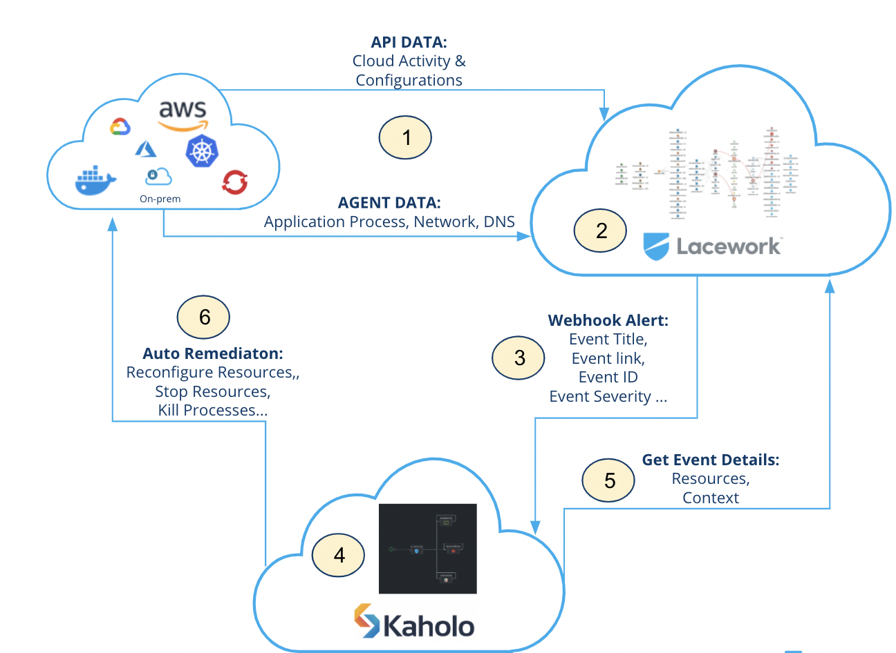

# lacework-kaholo-autoremediation

This repository is a collection of [Kaholo.io](https://www.kaholo.io) maps you can use as examples to automate the remediation of [Lacework](https://www.lacework.com/) alerts.

## What is auto remediate?
Auto remediation is the idea to automate responds to events with automated steps that are able to fix, or remediate, underlying conditions without the need of interaction from anyone. Auto remediation itself can be triggering a CLI command, a serverless function or an API call to remediate Alerts detected by Lacework. Automation of Remediation can be easy or complex depending on the alert and context correlated with the necessary remediation steps.

## Why should i use auto remediation?
We live in a complex world of Multi Cloud Environments. Cloud itself isn't as easy as it was sold to us. With the adoption of cloud and cloud native applications using modern technology like Kubernetes, Container and Serverless applications you automatically adopt endless complexity with many potential security risks. All of the services need to fulfill your security and compliance regulations. Your target should be to secure as much and as best as possible, independent of the industry and compliance regulations you need to fulfill.

Auto remediation means to automate the necessary steps of alert events detected by Lacework without any human interaction. Auto Remediation can partially or fully help to fix specific alerts.

Simplified you can say: "The more is automated, the faster you can react to alerts and the more time you safe for doing any manual interactions". Time is money and in security it means a risk you take while the alert is not solved. The MTTR (Mean Time to Repair) should be as fast as possible to not take any risks for a long time in case of an alert.

## Why Lacework and Kaholo?
Lacework and Kaholo is a perfect match!

Lacework itself is using Data ware house technology (Snowflake) and Machine Learning technology to reduce the number of false positive events and create high quality alerts (events). These Alerts from Lacework in general have a lot of high quality context information included that can be used to automate the necessary remediation steps.

Kaholo is an easy and intuitive workflow engine that makes it easy to create almost any automation processes, including advanced ones. On top of that you get central visibility into all automation processes. Instead of simply triggering a single CLI command or single API calls and serverless functions it allows the creation of complex workflows that might be necessary for specific auto remediation steps.

## How does it work?
The integration between Lacework and Kaholo is using the Alert [Webhook channel](https://support.lacework.com/hc/en-us/articles/360034367393-Webhook).

1. The Lacework Platform is collecting the necessary Cloud and Workload Data.
2. The Lacework Machine Learning algorithms learn the normal behaviour of cloud user and workload activity by using the Polygraph technology and comparing cloud resources against compliance frameworks.
3. In case of an Alert Lacework sends the necessary event details via the [Webhook channel](https://support.lacework.com/hc/en-us/articles/360034367393-Webhook).
4. The Kaholo [Lacework Trigger](https://github.com/Kaholo/kaholo-trigger-lacework) is reading out the **event_source** and **event_description** of the event. Every Kaholo Map is configured to check the event_source and the description if it includes specific information that is relevant to trigger the specific Kaholo Map.
5. The Kaholo Map triggered is reading out the specific Event Data  and Context by using the [Lacework Plugin](https://github.com/Kaholo/kaholo-plugin-lacework)
6. The Kaholo Map is doing all the necessary auto remediation steps by using the CLI commands of the cloud providers.

## How to start?

First of all you need to have a Lacework and Kaholo instance. For Lacework please contact us [here](https://info.lacework.com/contact) and the Kaholo team is available [here](https://kaholo.io/signup/). Lacework is a Saas offering only. Kaholo can be used On Premise or as Saas deployment.

1. First step is to setup the [Webhook channel](https://support.lacework.com/hc/en-us/articles/360034367393-Webhook) inside Lacework to forward Alerts to Kaholo.
2. Inside the Kaholo instance you need to install the Kaholo [Lacework Trigger](https://github.com/Kaholo/kaholo-trigger-lacework/tree/ilanyaniv-patch-1) and the [Lacework Plugin](https://github.com/Kaholo/kaholo-plugin-lacework).
3. The Kaholo Plugin itself needs to be configured with:
* [Lacework API Key](https://support.lacework.com/hc/en-us/articles/360011403853-Generate-API-Access-Keys-and-Tokens) (Saved inside the Kaholo Vault)
* [Lacework Secret Key](https://support.lacework.com/hc/en-us/articles/360011403853-Generate-API-Access-Keys-and-Tokens) (Saved inside the Kaholo Vault)
* Lacework Instance in format https://MYINSTANCE.lacework.net
4. Create a new Project inside Kaholo (example Lacework - AutoRemediation) as collection for the different auto remediation maps.
5. Start to import the necessary maps.

## Which Maps are already available?

This repository is a community project. Everyone interested can contribute and update existing and creating new maps. Currently the following Maps are available

### Compliance

#### AWS
Map ID | Cloud | Description | Status | Readme| CLI Remediation | Plugin Remediation
--- | --- | --- | --- | --- | --- | ---
LW_S3_1 | AWS | Ensure the S3 bucket ACL does not grant 'Everyone' READ permission [list S3 objects] | Prototype | [ReadMe](maps/compliance/aws/LW_S3_1/README.md) | yes | no

##### LW_S3_1

[ReadMe](maps/compliance/aws/LW_S3_1/README.md)
##### LW_S3_2
Ensure the S3 bucket ACL does not grant 'Everyone' WRITE permission [create, overwrite, and delete S3 objects]
[ReadMe](maps/compliance/aws/LW_S3_2/README.md)
##### LW_S3_3
Ensure the S3 bucket ACL does not grant 'Everyone' READ_ACP permission [read bucket ACL]
[ReadMe](maps/compliance/aws/LW_S3_3/README.md)
##### LW_S3_4
Ensure the S3 bucket ACL does not grant 'Everyone' WRITE_ACP permission [modify bucket ACL]
[ReadMe](maps/compliance/aws/LW_S3_4/README.md)
##### LW_S3_5
Ensure the S3 bucket ACL does not grant 'Everyone' FULL_CONTROL [READ, WRITE, READ_ACP, WRITE_ACP]
[ReadMe](maps/compliance/aws/LW_S3_5/README.md)
##### LW_S3_6
Ensure the S3 bucket ACL does not grant AWS users READ permission [list S3 objects]
[ReadMe](maps/compliance/aws/LW_S3_6/README.md)
##### LW_S3_7
Ensure the S3 bucket ACL does not grant AWS users WRITE permission [create, overwrite, and delete S3 objects]
[ReadMe](maps/compliance/aws/LW_S3_7/README.md)
##### LW_S3_8
Ensure the S3 bucket ACL does not grant AWS users READ_ACP permission [read bucket ACL]
[ReadMe](maps/compliance/aws/LW_S3_8/README.md)
##### LW_S3_9
Ensure the S3 bucket ACL does not grant AWS users WRITE_ACP permission [modify bucket ACL]
[ReadMe](maps/compliance/aws/LW_S3_9/README.md)
##### LW_S3_10
Ensure the S3 bucket ACL does not grant AWS users FULL_CONTROL [READ, WRITE, READ_ACP, WRITE_ACP]
[ReadMe](maps/compliance/aws/LW_S3_10/README.md)
##### LW_S3_11
Ensure the attached S3 bucket policy does not grant 'Allow' permission to everyone
[ReadMe](maps/compliance/aws/LW_S3_11/README.md)
##### LW_S3_12
Ensure the S3 bucket requires MFA to delete objects
[ReadMe](maps/compliance/aws/LW_S3_12/README.md)
##### LW_S3_13
Ensure the S3 bucket has access logging enabled
[ReadMe](maps/compliance/aws/LW_S3_13/README.md)
##### LW_S3_14
Ensure all data stored in the S3 bucket is securely encrypted at rest
[ReadMe](maps/compliance/aws/LW_S3_14/README.md)
##### LW_S3_15
Ensure all data is transported from the S3 bucket securely
[ReadMe](maps/compliance/aws/LW_S3_15/README.md)
##### LW_S3_16
Ensure the S3 bucket has versioning enabled
[ReadMe](maps/compliance/aws/LW_S3_16/README.md)
##### LW_S3_17
Ensure the S3 bucket access is restricted to a whitelist of IP networks.
[ReadMe](maps/compliance/aws/LW_S3_17/README.md)
##### LW_S3_18
Ensure the attached S3 bucket policy does not grant global 'Get' permission.
[ReadMe](maps/compliance/aws/LW_S3_18/README.md)
##### LW_S3_19
Ensure the attached S3 bucket policy does not grant global 'Delete' permission.
[ReadMe](maps/compliance/aws/LW_S3_19/README.md)
##### LW_S3_20
Ensure the attached S3 bucket policy does not grant global 'List' permission.
[ReadMe](maps/compliance/aws/LW_S3_20/README.md)
##### LW_S3_21
Ensure the attached S3 bucket policy does not grant global 'Put' permission.
[ReadMe](maps/compliance/aws/LW_S3_21/README.md)

The current updates and releases are tracked inside the [Release Notes](ReleaseNotes.md) document.

## Roadmap

The current target Roadmap is to build the following example Maps:

1. Auto Remediation Maps for all the Lacework AWS Compliance checks
2. Auto Remediation Maps for all the Lacework Azure Compliance checks
3. Auto Remediation Maps for all the Lacework GCP Compliance checks
4. Auto Remediation Maps for all the Lacework AWS User Activity events.
5. Auto Remediation Maps for all the Lacework Azure User Activity events.
6. Auto Remediation Maps for all the Lacework Application and Workload events.

## Least Privilege

As part of the example Maps we also plan to create and document Least Privilege roles, so the automation scripts can only change what the roles and permissions allow them to change.
