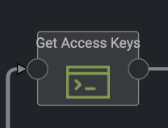
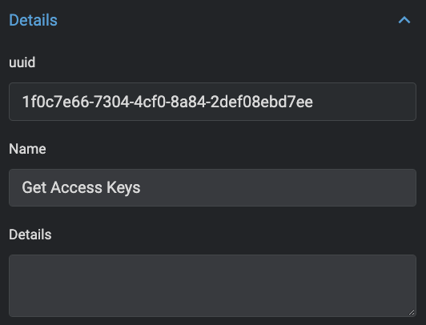

# AutoRemediation for the Lacework Policy AWS_CIS_1_12

## Description
The "root" account has unrestricted access to all resources in the AWS account. It is highly recommended that the use of this account be avoided.

**Rationale:**
The "root" account is the most privileged AWS account. Minimizing the use of this account and adopting the principle of least privilege for access management will reduce the risk of accidental changes and unintended disclosure of highly privileged credentials

### Severity
Critical

### Control ID
AWS_CIS_1_12

### Remediation Steps to manually fix this

Make sure that the root account is not used at all via Console Login or API Login. One possible manual remediation could be to remove access keys for the root account.

Perform the following to delete or disable active root access keys being attached to the root account.

Via the AWS Console
1. Sign in to the AWS Management Console as Root and open the IAM console at
https://console.aws.amazon.com/iam/.
2. Click on <Root_Account_Name> at the top right and select Security Credentials
from the drop down list
3. On the pop out screen Click on Continue to Security Credentials
4. Click on Access Keys (Access Key ID and Secret Access Key)
5. Under the Status column if there are any Keys which are Active
1. Click on Make Inactive - (Temporarily disable Key - may be needed again)
2. Click Delete - (Deleted keys cannot be recovered)

## How can i use this Map for Auto Remediation?

We recommend to make sure you do not need the access keys used by the root account before you enable the auto remediation of this map. We recommend to check the usage of the root account with the UBEA capabilities of Lacework to see if the access keys are used for specific AWS services and API calls.

## Import the Map

The Map needs to be imported inside an existing or new Kaholo Project.

### Map Design and workflow
The **AWS_CIS_1_12** map currently has the following map design:


### Map trigger

Make sure that the Map Webhook Trigger is configured with the following configuration:


1. The Configuration setting needs to be configured with **LaceworkConfig** to make sure the Configuration **LaceworkConfig** is used when the map is triggered.
2. The Plugin setting needs to be configured with the Lacework Webhook Plugin **kaholo-trigger-lacework**
3. For the Method setting you need to select **Lacework Alert**
4. The Variable **Event type** needs to be configured with Value **Compliance**
5. The Variable **Recommendation ID** needs to be configured with Value **AWS_CIS_1_12**.
6. The Variable **Event Severity** needs to be configured with the Value **Any** or **High**
7. Make sure to enable the Checkbox **Include Higher Severities**.

This configuration will make sure that this map is only triggered if the **rec_id** of the [Webhook payload](https://support.lacework.com/hc/en-us/articles/360034367393-Webhook) is equal to the **AWS_CIS_1_12** Event ID.

### Configuration of the Map

By default the map is using the **LaceworkConfig** configurations that are imported as part of the map.

By default the map has the following configurations:

```
{
    "name": "LaceworkConfiguration",
    "rec_id": "AWS_CIS_1_12",
    "violationdescription": "Avoid the use of the root account",
    "eventuuid": "2a25ae82-c917-4cb4-945a-4408dbe65a43",
    "reportuuid": "f6906a3a-06b8-4952-b258-c16f3e866e0c",
    "getaccesskeyuuid": "1f0c7e66-7304-4cf0-8a84-2def08ebd7ee",
    "getaccesskeyviacli": "false",
    "makeaccesskeyinactiveviacli": "false",
    "removeaccesskeyviacli": "false",
    "sendslackmessages": "false",
    "sendslackmessagesforignored": "false",
    "IgnoreList":[
        "arn:aws:iam::123456789012:root",
        "arn:aws:iam::123456789011:root"
    ],
    "awsaccountid": "123456789012",
    "reporttype": "AWS_CIS_S3"
}
```

Make sure you configure the following configurations inside the **LaceworkConfig** Configuration of the map

#### General Settings

1. **eventuuid:** Make sure that the **uuid** used here is the uuid of the **Get event details** object inside the map. Due to the reimport of the Map the **uuid** of the event object could have changed. To check the uuid you can go to the Design of the map, open the **Get event details** building block.


Inside the configuration of the **Get event details** building block you will find the **uuid**:


2. **reportuuid:** Make sure that the **uuid** used here is the uuid of the **Get report details** object inside the map. Due to the reimport of the Map the **uuid** of the event object could have changed. To check the uuid you can go to the Design of the map, open the **Get report details** building block.


Inside the configuration of the **Get report details** building block you will find the **uuid**:


3. **getaccesskeyuuid:** Make sure that the **uuid** used here is the uuid of the **Get Access Keys** object inside the map. Due to the reimport of the Map the **uuid** of the event object could have changed. To check the uuid you can go to the Design of the map, open the **Get Access Keys** building block.



Inside the configuration of the **Get current suppression configuration** building block you will find the **uuid**:



#### Auto Remediation

For the Auto Remediation the map currently supports the deletion of every access key for the root user account or to make all the access keys inactive so it will no longer be used via api access. For this you need to enable the **getaccesskeyviacli** to read out the AWS access keys and the **removeaccesskeyviacli** to delete the access keys or the **makeaccesskeyinactiveviacli** to make them inactive In total a AWS rootuser can only have 2 access keys.

1. If you configured **getaccesskeyviacli** equals **true** the map will read out the current access keys information by using the following AWS CLI command:

```
aws iam list-access-keys --user <ROOTUSERNAME> --profile AWS-ACCOUNTID-FROM-EVENTORREPORT
```

2. If you configured the **removeaccesskeyviacli** equals **true** you must make sure to also enable the **getaccesskeyviacli** equals **true** to read out the current access keys. After that it will execute the following AWS CLI command against the maximum of two access keys:

```
aws iam delete-access-key --user <ROOTUSERNAME> --access-key-id ID-FOR-EACH-ACCESS-KEY --profile AWS-ACCOUNTID-FROM-EVENTORREPORT
```

3. If you configured the **makeaccesskeyinactiveviacli** equals **true** you must make sure to also enable the **getaccesskeyviacli** equals **true** to read out the current access keys. After that it will execute the following AWS CLI command against the maximum of two access keys:
```
aws iam update-access-key --user-name <ROOTUSERNAME> --access-key-id ID-FOR-EACH-ACCESS-KEY --status Inactive --profile AWS-ACCOUNTID-FROM-EVENTORREPORT
```

#### Configuration of Slack Messages

1. **rec_id:** This shouldn't be changed. The Policy ID will be shown as part of the slack output messages and to check if the event or the report has a root account violating this policy ID.

2. **violationdescription:** This setting is used to send details about the event inside the slack output message. Feel free to change it for your needs.

3. For the Slack building blocks **Remediated** and **Ignored** you can configure a Slack Webhook URL that you have to implement inside the Kaholo Vault before you can select it.

It will send out a slack message to the configured Webhook. We recommend to configure it similar to the Webhook you use within Lacework as an alert channel so you can see the Auto Remediation effect right after the alert was send by Lacework.

If you don't have Slack or don't need Slack messages feel free to simply remove both Slack objects from your map.

4. **sendslackmessages (Optional):** you can disable within the **LaceworkConfig** via the setting equals **false** to not send slack Slack messages for a root account that is violating this policy.

5. **sendslackmessagesforignored (Optional):** you can disable within the **LaceworkConfig** via the setting equals **false** to not send out Slack messages for a root account that are violating the policy but are ignored via the **IgnoreList**. By default this is configured to **true**.

## Build an example curl webhook

There is no need to wait for Lacework sending the Webhook Alert for the generated Event when you want to test the map. If you plan to test it immediately, you can trigger the map by using a simple curl command that will send the necessary information or you can manually start the map, so it will use the latest AWS report instead of an event.

Before you can trigger the webhook you need to have an event generated within your Lacework instance. Please make sure you run a compliance report right after you created a test S3 bucket that is violating this policy.

Events are generated every hour after the compliance report was finished. As soon as you got an event we recommend using the Event Information to create an example webhook trigger inside your terminal using the following environment variables. Make sure to update it with the information from the Event you did generate.

```
export EVENTTITLE="New Violations"
export EVENTTYPE=Compliance
export EVENTTIMESTAMP="27 Jan 2021 16:00 GMT"
export EVENTSOURCE=AWSCompliance
export EVENTID=11
export EVENTSEVERITY=1
export WEBHOOKURL=https://mykaholoinstance.kaholo.io/webhook/lacework/alert
export LACEWORKINSTANCE=mylaceworkinstance
export EVENTDESCRIPTION="AWS Account 112233445566 (lacework-test) : AWS_CIS_1_12 Avoid the use of the 'root' account"
export REC_ID=AWS_CIS_1_12
```
You need to replace the following before you apply the environment variables:
1. **EVENTID** with the EventID that was generated inside the Lacework environment.
2. **WEBHOOKURL** with your Kaholo Webhook Url. Normally kaholo is listening on port 3000 and the URL path for the webhook alerting is /webhook/lacework/alert.
3. **LACEWORKINSTANCE** your Lacework instance where you created that event.
4. **EVENTDESCRIPTION** replace the AWS Account with your environment specific AWS Account ID.

With that you can trigger the webhook inside kaholo by using the following curl command:

```
curl -X POST -H 'Content-type: application/json' --data '{"event_title": "'"$EVENTTITLE"'", "event_link": "https://'"$LACEWORKINSTANCE"'.lacework.net/ui/investigation/recents/EventDossier-'"$EVENTID"'", "lacework_account": "'"$LACEWORKINSTANCE"'", "event_source": "'"$EVENTSOURCE"'", "event_description":"'"$EVENTDESCRIPTION"'", "event_timestamp":"'"$EVENTTIMESTAMP"'", "event_type": "Compliance", "event_id": "'"$EVENTID"'", "event_severity": "'"$EVENTSEVERITY"'", "rec_id": "'"$REC_ID"'"}' $WEBHOOKURL
```
We recommend to check the Execution Results when you give it a try. With that you make sure it will remediate the right S3 buckets before you enable the auto remediation.

## AWS accounts and required AWS permissions (least privilege)

The Map supports multiple AWS accounts for events send by Lacework. You need to make sure that you saved your AWS account access keys and the AWS secret access keys in the following format:

* **AWS-ACCOUNT-ACCESS-KEY-ID_aws_access_key_id**: example 12345678912_aws_access_key_id
* **AWS-ACCOUNT-SECRET-ACCESS-KEY-ID_aws_secret_access_key_id**: example 12345678912_aws_secret_access_key_id

We recommend to use the Map with the principals of least privilege to make sure the Auto Remediation account can only change the S3 Bucket ACL and the Resource Tags.

The Map is using (needs to be updated with least privilege)

## What features are supported with this Map? Release Notes

Tha Map Version 1.1 (7th of September 2021) supports also now:
* Making the access keys of the root user account inactive.

The Map Version 1.0 (6th of September 2021) supports the following:
* Auto Remediation of to delete all access key for the root users
* Sending Slack messages for the root accounts violating the policy
* Sending Slack messages if the root account is ignored.

## Ideas for future releases

* Adding information about the least privilege role necessary to execute this map.
* Adding Auto Remediation example with Lambda functions
* Adding Auto Remediation example with terraform
* Adding Auto Remediation example with pulumi
