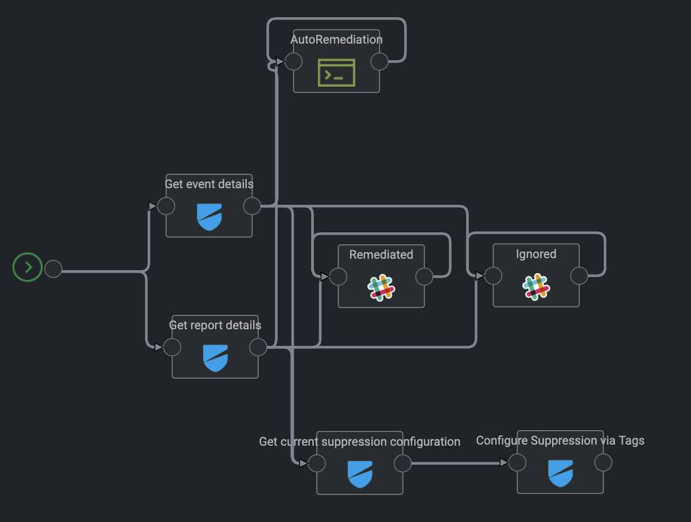
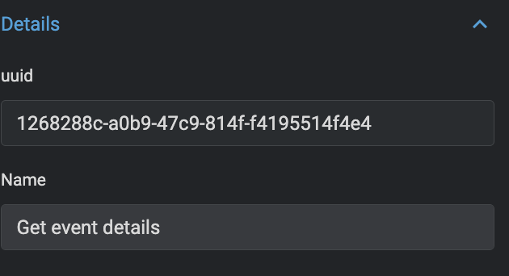
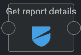

# AutoRemediation for the Lacework Policy AWS_CIS_1_3

## Description
Ensure credentials unused for 90 days or greater are disabled

AWS IAM users can access AWS resources using different types of credentials, such as
passwords or access keys. It is recommended that all credentials that have been unused in
90 or greater days be removed or deactivated.

**Rationale:**
Disabling or removing unnecessary credentials will reduce the window of opportunity for
credentials associated with a compromised or abandoned account to be used.

### Severity
High

### Control ID
AWS_CIS_1_3

### Remediation Steps to manually fix this

Perform the following to remove or deactivate credentials:
1. Login to the AWS Management Console:
2. Click Services
3. Click IAM
4. Click on Users
5. Click on Security Credentials
6. As an Administrator
o Click on Make Inactive for credentials that have not been used in 90 Days
7. As an IAM User
o Click on Make Inactive or Delete for credentials which have not been used
in 90 Days

## How can i use this Map for Auto Remediation?

This map can be used to tigger a auto remediation for each affected user account.

## Import the Map

The Map needs to be imported inside an existing or new Kaholo Project.

### Map Design and workflow
The **AWS_CIS_1_3** map currently has the following map design:



### Map trigger

Make sure that the Map Webhook Trigger is configured with the following configuration:


1. The Configuration setting needs to be configured with **LaceworkConfig** to make sure the Configuration **LaceworkConfig** is used when the map is triggered.
2. The Plugin setting needs to be configured with the Lacework Webhook Plugin **kaholo-trigger-lacework**
3. For the Method setting you need to select **Lacework Alert**
4. The Variable **Event type** needs to be configured with Value **Compliance**
5. The Variable **Recommendation ID** needs to be configured with Value **AWS_CIS_1_3**.
6. The Variable **Event Severity** needs to be configured with the Value **Any** or **High**
7. Make sure to enable the Checkbox **Include Higher Severities**.

This configuration will make sure that this map is only triggered if the **rec_id** of the [Webhook payload](https://support.lacework.com/hc/en-us/articles/360034367393-Webhook) is equal to the **AWS_CIS_1_3** Event ID.

### Configuration of the Map

By default the map is using the **LaceworkConfig** configurations that are imported as part of the map.

By default the map has the following configurations:

```
{
    "name": "LaceworkConfiguration",
    "rec_id": "AWS_CIS_1_3",
    "violationdescription": "Ensure multi-factor authentication (MFA) is enabled for all IAM users that have a console password",
    "eventuuid": "1268288c-a0b9-47c9-814f-f4195514f4e4",
    "reportuuid": "44f37362-f1fb-447b-8723-941943b28d26",
    "autoremediationviacli": "false",
    "sendslackmessagesforremediation": "true",
    "sendslackmessagesforignored": "true",
    "IgnoreList":[
        "arn:aws:iam::123456789012:user/andreas",
        "arn:aws:iam::123456789012:user/tim"
    ],
    "awsaccountid": "950194951070",
    "reporttype": "AWS_CIS_S3",
    "putbuckettaggingviacli": "false",
    "putbuckettaggingviaobject": "false",
    "tagname": "AWS_CIS_1_3",
    "tagvalue": "suppressed",
    "configuresuppressiononpolicy": "false",
    "suppressionpolicycomment": "Auto Configured via Kaholo"
}
```

Make sure you configure the following configurations inside the **LaceworkConfig** Configuration of the map

#### General Settings

1. **eventuuid:** Make sure that the **uuid** used here is the uuid of the **Get event details** object inside the map. Due to the reimport of the Map the **uuid** of the event object could have changed. To check the uuid you can go to the Design of the map, open the **Get event details** building block.


Inside the configuration of the **Get event details** building block you will find the **uuid**:



2. **reportuuid:** Make sure that the **uuid** used here is the uuid of the **Get report details** object inside the map. Due to the reimport of the Map the **uuid** of the event object could have changed. To check the uuid you can go to the Design of the map, open the **Get report details** building block.



Inside the configuration of the **Get report details** building block you will find the **uuid**:


#### Auto Remediation

For the Auto Remediation the map currently has a single Command Line object that can be used and extended to define Auto Remediation for this map. This can be enabled by configuring **autoremediation** to **true** inside the configuration of the map. For now the map will only echo the number of ressources that are violating the rule if it is enabled with true:
```
echo doing autoremediation for resource ${arr2[arr2.length - 1]}
```

#### Configuration of Slack Messages

1. **rec_id:** This shouldn't be changed. The Policy ID will be shown as part of the slack output messages and to check if the event or the report has a root account violating this policy ID.

2. **violationdescription:** This setting is used to send details about the event inside the slack output message. Feel free to change it for your needs.

3. For the Slack building blocks **Remediated** and **Ignored** you can configure a Slack Webhook URL that you have to implement inside the Kaholo Vault before you can select it.

It will send out a slack message to the configured Webhook. We recommend to configure it similar to the Webhook you use within Lacework as an alert channel so you can see the Auto Remediation effect right after the alert was send by Lacework.

If you don't have Slack or don't need Slack messages feel free to simply remove both Slack objects from your map.

4. **sendslackmessages (Optional):** you can disable within the **LaceworkConfig** via the setting equals **false** to not send slack Slack messages for a root account that is violating this policy.

5. **sendslackmessagesforignored (Optional):** you can disable within the **LaceworkConfig** via the setting equals **false** to not send out Slack messages for a root account that are violating the policy but are ignored via the **IgnoreList**. By default this is configured to **true**.

## Suppression api

This map supports the definition of Advanced Suppression rules in Lacework based on Tags by configuring the **configuresuppressiononpolicy** equals **true** . However, the current version of Lacework does not allow the usage of suppression rules.

## Build an example curl webhook

There is no need to wait for Lacework sending the Webhook Alert for the generated Event when you want to test the map. If you plan to test it immediately, you can trigger the map by using a simple curl command that will send the necessary information or you can manually start the map, so it will use the latest AWS report instead of an event.

Before you can trigger the webhook you need to have an event generated within your Lacework instance. Please make sure you run a compliance report right after you created a test S3 bucket that is violating this policy.

Events are generated every hour after the compliance report was finished. As soon as you got an event we recommend using the Event Information to create an example webhook trigger inside your terminal using the following environment variables. Make sure to update it with the information from the Event you did generate.

```
export EVENTTITLE="New Violations"
export EVENTTYPE=Compliance
export EVENTTIMESTAMP="27 Jan 2021 16:00 GMT"
export EVENTSOURCE=AWSCompliance
export EVENTID=11
export EVENTSEVERITY=1
export WEBHOOKURL=https://mykaholoinstance.kaholo.io/webhook/lacework/alert
export LACEWORKINSTANCE=mylaceworkinstance
export EVENTDESCRIPTION="AWS Account 112233445566 (lacework-test) : AWS_CIS_1_3 Ensure multi-factor authentication (MFA) is enabled for all IAM users that have a console password
export REC_ID=AWS_CIS_1_3
```
You need to replace the following before you apply the environment variables:
1. **EVENTID** with the EventID that was generated inside the Lacework environment.
2. **WEBHOOKURL** with your Kaholo Webhook Url. Normally kaholo is listening on port 3000 and the URL path for the webhook alerting is /webhook/lacework/alert.
3. **LACEWORKINSTANCE** your Lacework instance where you created that event.
4. **EVENTDESCRIPTION** replace the AWS Account with your environment specific AWS Account ID.

With that you can trigger the webhook inside kaholo by using the following curl command:

```
curl -X POST -H 'Content-type: application/json' --data '{"event_title": "'"$EVENTTITLE"'", "event_link": "https://'"$LACEWORKINSTANCE"'.lacework.net/ui/investigation/recents/EventDossier-'"$EVENTID"'", "lacework_account": "'"$LACEWORKINSTANCE"'", "event_source": "'"$EVENTSOURCE"'", "event_description":"'"$EVENTDESCRIPTION"'", "event_timestamp":"'"$EVENTTIMESTAMP"'", "event_type": "Compliance", "event_id": "'"$EVENTID"'", "event_severity": "'"$EVENTSEVERITY"'", "rec_id": "'"$REC_ID"'"}' $WEBHOOKURL
```
We recommend to check the Execution Results when you give it a try. With that you make sure it will remediate the right S3 buckets before you enable the auto remediation.

## AWS accounts and required AWS permissions (least privilege)

The Map supports multiple AWS accounts for events send by Lacework. You need to make sure that you saved your AWS account access keys and the AWS secret access keys in the following format:

* **AWS-ACCOUNT-ACCESS-KEY-ID_aws_access_key_id**: example 12345678912_aws_access_key_id
* **AWS-ACCOUNT-SECRET-ACCESS-KEY-ID_aws_secret_access_key_id**: example 12345678912_aws_secret_access_key_id

We recommend to use the Map with the principals of least privilege to make sure the Auto Remediation account can only change the S3 Bucket ACL and the Resource Tags.

The Map is using (needs to be updated with least privilege)

## What features are supported with this Map? Release Notes

The Map Version 1.0 (13th of January 2022) supports the following:
* Create a custom Auto Remediation.
* Sending Slack messages for the user accounts violating the policy
* Sending Slack messages if the user account is ignored.

## Ideas for future releases

* Adding information about the least privilege role necessary to execute this map.
* Adding Auto Remediation example with Lambda functions
* Adding Auto Remediation example with terraform
* Adding Auto Remediation example with pulumi
