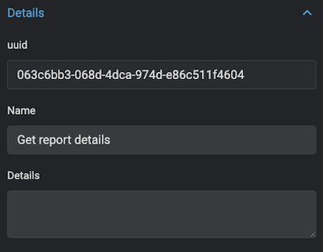

# AutoRemediation for the Lacework Policy LW_S3_1

## Description
Ensure the S3 bucket ACL does not grant 'Everyone' READ permission [list S3 objects]

The S3 bucket ACL gives 'Everyone' permission to list objects, which allows anyone to list the
bucket contents. It is best practice to restrict READ permission to only principals who require it.

**Rationale:**
Granting ‘Everyone’ READ permission allows anyone, including anonymous users from the
Internet, to list all objects in a bucket. Malicious users can use this information to identify and
exploit objects with misconfigured ACL permissions.

### Severity
Critical

### Control ID
LW_S3_1

### Remediation Steps to manually fix this

Perform the following to revoke READ permission for 'Everyone':
1. Sign in to the AWS Management Console
2. Open the S3 Service - https://console.aws.amazon.com/s3/
3. From the list of buckets, select the bucket you want to change
4. Navigate to the permissions tab
5. Select Access Control List from the permissions tab
6. Under Public access, uncheck the Group ‘Everyone’ by clicking the circular button in front of
it
7. Uncheck ‘List objects’ under ‘Access to the objects’
8. Click 'Save' to remove the permission for ‘Everyone’
9. Repeat steps 3-8 for every bucket for which you want to change permissions

## How can i use this Map for Auto Remediation?

We recommend to create an S3 test bucket and configure it to give everyone READ permission. This will generate an event and alert inside Lacework during the next compliance check. By default the compliance check is done once per day (every 24 hours). You can force to create a compliance check for CIS Benchmarks via the Lacework GUI or the API. Out of the compliance check an Event will be generated can then be used to test the Auto Remediation of this Map.

You can use the following AWS CLI command to configure an existing S3 test bucket to give everyone READ permission:

```
aws s3api put-bucket-acl --bucket <YOURBUCKETNAME> --acl public-read
```

**Note:** Make sure you configure the **YOURBUCKETNAME** with the name of the S3 test bucket you would like to use for tests. Don't use any S3 bucket with important data! This if for testing of this map only and it should not have any important data.

## Import the Map

The Map needs to be imported inside an existing or new Kaholo Project.

### Map Design and workflow
The **LW_S3_1** map currently has the following map design:


* The map will start with the **Get event details** object when it was triggered by the [Lacework Trigger](https://github.com/Kaholo/kaholo-trigger-lacework). It will use the **event_id** send by the [Webhook payload](https://support.lacework.com/hc/en-us/articles/360034367393-Webhook), using the **Lacework API Access Key** and  **Lacework Secret Key** from the Kaholo vault that you used to configure the [Lacework Plugin](https://github.com/Kaholo/kaholo-plugin-lacework). The Method **Get event details** will create a [temporary API token](https://support.lacework.com/hc/en-us/articles/360011403853-Generate-API-Access-Keys-and-Tokens). This token is used to query the [Lacework API](https://lwcs.lacework.net/api/v1/external/docs) via the API call **/api/v1/external/events/GetEventDetails** of the configured [Lacework Plugin](https://github.com/Kaholo/kaholo-plugin-lacework) host instance. The return value of this API call is the complete Event Payload you can use within the Map.
* The map will start with the **Get report details** object when the map was manually started by a user of the map. It will start use  the **Lacework API Access Key** and  **Lacework Secret Key** from the Kaholo vault that you used to configure the [Lacework Plugin](https://github.com/Kaholo/kaholo-plugin-lacework). The Method **GetLatestAWSComplianceReportDetails** will create a [temporary API token](https://support.lacework.com/hc/en-us/articles/360011403853-Generate-API-Access-Keys-and-Tokens). This token is used to query the [Lacework API](https://lwcs.lacework.net/api/v1/external/docs) via the API call **/api/v1/external/compliance/aws/GetLatestComplianceReport** of the configured [Lacework Plugin](https://github.com/Kaholo/kaholo-plugin-lacework) host instance that is using **configuration.aws_account_id** of the LaceworkConfig as a parameter.
* The map will trigger the **Remediate via CLI** CommandLine object If you enabled the Auto Remediation via the CLI inside the LaceworkConfig of the map by using the **"dotheremediationviacli": "true"** setting. It will print out the name of the S3 buckets that will be remediated and uses the AWS CLI to remediate the S3 buckets.
* The map will trigger the **Remediate via Object** Amazon-aws-s3 object if you enabled the Auto Remediation via the Object inside the LaceworkConfig of the map by using the **"dotheremediationviaobject": "true"** setting. it will remediate all S3 buckets by using the Method **apply canned ACL to Bucket** from the [S3 bucket plugin](https://github.com/Kaholo/kaholo-plugin-amazon-s3).
* The map will send out a Slack message for each S3 bucket that will be remediated to the Webhook you configured for the **Remediated** Slack object.
* If you enabled the configuration to send out slack messages for ignored S3 buckets inside the LaceworkConfig of the map to **"sendslackmessagesforignored": "true"** it will send out a slack message for each bucket that is violating the policy and ignored by the configuration to the Webhook you configured for the **Ignored** Slack object.

### Map trigger

Make sure that the Map Webhook Trigger is configured with the following configuration:


1. The Configuration needs to be configured with **LaceworkConfig** to make sure the Configuration LaceworkConfig is used when the map is triggered.
2. The Plugin setting needs to be configured with the Lacework Webhook Plugin **kaholo-trigger-lacework**
3. The Method **Lacework Alert** needs to be selected
4. The Variable **Event type** needs to be configured with Value **Compliance**
5. The Variable **Event ID** needs to be configured with Value **LW_S3_1**.
6. The Variable **Event Severity** needs to be configured with the Value **Any** or **High**

This configuration will make sure that this map is only triggered if the **event_description** of the [Webhook payload](https://support.lacework.com/hc/en-us/articles/360034367393-Webhook) includes the **LW_S3_1** Event ID.

### Configuration of the Map

By default the map is using the **LaceworkConfig** configurations that are imported as part of the map.

By default the map has the following configurations:

```
{
    "name": "LaceworkConfiguration",
    "policyID": "LW_S3_1",
    "violationdescription": "Ensure the S3 bucket ACL does not grant Everyone READ permission",
    "eventuuid": "1f34062d-2299-4417-ade7-69d3ce1e3c0a",
    "reportuuid": "063c6bb3-068d-4dca-974d-e86c511f4604",
    "dotheremediationviacli": "false",
    "dotheremediationviaobject": "true",
    "sendslackmessagesforignored": "true",
    "bucketIgnoreList":[
        "arn:aws:s3:::mybucket01",
        "arn:aws:s3:::mybucket02",
        "arn:aws:s3:::mybucket03"
    ],
    "awsaccountid": "123456789012"
}
```

Make sure you configure the following configurations inside the **LaceworkConfig** Configuration of the map

#### General Settings

1. **eventuuid:** Make sure that the **UUID** used here is the UUID of the **Get event details** object inside the map. Due to the reimport of the Map the **UUID** of the event object could have changed. To check the UUID you can go to the Design of the map, open the **Get event details** building block.


Inside the configuration of the **Get event details** building block you will find the **UUID**:


1. **reportuuid:** Make sure that the **UUID** used here is the UUID of the **Get report details** object inside the map. Due to the reimport of the Map the **UUID** of the event object could have changed. To check the UUID you can go to the Design of the map, open the **Get report details** building block.


Inside the configuration of the **Get event details** building block you will find the **UUID**:



3. **bucketIgnoreList(Optional):** You can configure the Map to ignore specific S3 buckets from Auto Remediation. Make sure you configured the correct AWS S3 bucket names that should be ignored within the bucketIgnoreList of the LaceworkConfig.

#### Auto Remediation

For the Auto Remediation you need to decide if you would like to Auto Remediate by using the AWS CLI or the Kaholo S3 Bucket Object.

The Auto Remediation is disabled if you import the map. It will only be triggered if the configuration **dotheremediationviacli** or **dotheremediationviaobject** of the LaceworkConfig is configured with **true**. Before enabling this we recommend the following:

1. Create a test S3 bucket that is violating the compliance rule for **LW_S3_1** via the CLI command described in the section [How can i use the Map?](https://github.com/automatecloud/lacework-kaholo-autoremediation/tree/main/maps/compliance/aws/LW_S3_1#how-can-i-use-this-map-for-auto-remediation)
2. When you got the Event created in Lacework you need to make sure that you put all the S3 bucket names that should not be Auto Remediated into the bucketIgnoreList of the LaceworkConfig.
3. To be even more sure we recommend to configure a suppression setting for the **LW_S3_1** compliance check within the Lacework platform to ignore the S3 bucket. Otherwise the ignored Buckets will create additional Events and Alerts within Lacework. Future versions of this Map will enable the auto creation of AWS Tags.
4. After that you can enable the Auto Remediation via CLI or via the Kaholo S3 Bucket Object.

**Note:** you can choose to do the Auto Remediation via the CLI **"dotheremediationviacli": "true"** or by using the Kaholo S3 bucket object **"dotheremediationviaobject": "true"**. By default both settings are configured to **false**, so it will not by accident start to remediate misconfigured S3 buckets. We recommend to make sure that only the right buckets will be remediated and the map is working as expected before you configure any of both settings to true. Do not configure **dotheremediationviacli** and **dotheremediationviaobject** both at the same time to **true**. The map will check that possible misconfiguration at the beginning of the map and not execute. Only one of both can be enabled and used for the Auto Remediation.

5. If you configure the **dotheremediationviacli** settings to **true** to enable the Auto Remediation via CLI, make sure you select an Agent for the Map that has the AWS CLI installed and configured. The Remediation via CLI block will Auto Remediate by using the following AWS CLI command that will put the ACL back into private mode, which means only the owner will be able to list and write on Objects and read and write on the Bucket ACL:

```
aws s3api put-bucket-acl --bucket <YOURBUCKETNAME> --acl private
```

If you want to know more about the aws s3api put-bucket-acl command or want to replace it with a different option for auto remediation we recommend to take a look at the official documentation available [here](https://awscli.amazonaws.com/v2/documentation/api/latest/reference/s3api/put-bucket-acl.html).

6. If you configure the **dotheremediationviacli** to **true** the Remediation via Object block will Auto Remediate by using the Kaholo S3 bucket plugin. For this you need to make sure that the **remediateviaobject** action has the correct configured AWS access key, AWS secret key and the correct AWS region. the S3 bucket name will be created by using the **remediateviaobject** function, and the Canned ACL Type is configured to **Private**

#### Configuration of Slack Messages


1. **policyID:** This shouldn't be changed. The Policy ID will be shown as part of the slack output messages.

2. **violationdescription:** This setting is used to send details about the event inside the slack output message. Feel free to change it for your needs.

3. For the Slack building blocks **Remediated** and **Ignored** you can configure a Slack Webhook URL that you have to implement inside the Kaholo Vault before you can select it.

It will send out a slack message to the configured Webhook. We recommend to configure it similar to the Webhook you use within Lacework as an alert channel so you can see the Auto Remediation effect right after the alert was send by Lacework.

If you don't have Slack or don't need Slack messages feel free to simply remove both Slack objects from your map.

4. **sendslackmessagesforignored (Optional):** you can disable within the LaceworkConfig via **"sendslackmessagesforignored": "false"** to not send out Slack messages for S3 buckets that are violating the policy but are ignored via the **bucketIgnoreList**. By default this is configured to **true**. Reason behind is that it is best practice to suppress S3 buckets that should not be Auto Remediated by using Tags within AWS so you can configure a Suppress rule within Lacework to simply ignore them and not create events and alerts.

## Build an example curl webhook

There is no need to wait for Lacework sending the Webhook Alert for the generated Event when you want to test the map. If you plan to test it immediately, you can trigger the map by using a simple curl command that will send the necessary information.

Before you can trigger the webhook you need to have an event generated within your Lacework instance. Please make sure you run a compliance report right after you created a test S3 bucket that is violating this policy.

As soon as you got an event we recommend using the Event Information to create an example webhook trigger inside your terminal using the following environment variables. Make sure to update it with the information from the Event you did generate.#

```
export EVENTTITLE="New Violations"
export EVENTTYPE=Compliance
export EVENTTIMESTAMP="27 Jan 2021 16:00 GMT"
export EVENTSOURCE=AWSCompliance
export EVENTID=11
export EVENTSEVERITY=1
export WEBHOOKURL=https://mykaholoinstance.kaholo.io/webhook/lacework/alert
export LACEWORKINSTANCE=mylaceworkinstance
export EVENTDESCRIPTION="AWS Account 112233445566 (lacework-test) : LW_S3_1 Ensure the S3 bucket ACL does not grant 'Everyone' READ permission [list S3 objects]"
```
You need to replace the following before you apply the environment variables:
1. **EVENTID** with the EventID that was generated inside the Lacework environment.
2. **WEBHOOKURL** with your Kaholo Webhook Url. Normally kaholo is listening on port 3000 and the URL path for the webhook alerting is /webhook/lacework/alert.
3. **LACEWORKINSTANCE** your Lacework instance where you created that event.
4. **EVENTDESCRIPTION** replace the AWS Account with your environment specific AWS Account ID.

With that you can trigger the webhook inside kaholo by using the following curl command:

```
curl -X POST -H 'Content-type: application/json' --data '{"event_title": "'"$EVENTTITLE"'", "event_link": "https://'"$LACEWORKINSTANCE"'.lacework.net/ui/investigation/recents/EventDossier-'"$EVENTID"'", "lacework_account": "'"$LACEWORKINSTANCE"'", "event_source": "'"$EVENTSOURCE"'", "event_description":"'"$EVENTDESCRIPTION"'", "event_timestamp":"'"$EVENTTIMESTAMP"'", "event_type": "Compliance", "event_id": "'"$EVENTID"'", "event_severity": "'"$EVENTSEVERITY"'"}' $WEBHOOKURL
```
We recommend to check the Execution Results when you give it a try. With that you make sure it will remediate the right S3 buckets before you enable the auto remediation.
