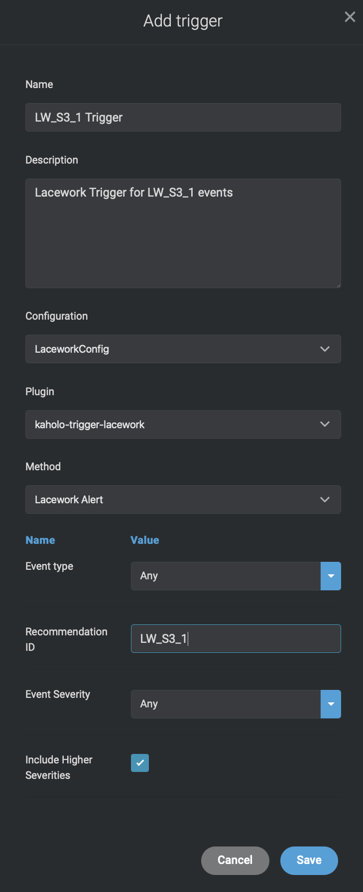

# AutoRemediation for the Lacework Policy LW_S3_1

## Description
Ensure the S3 bucket ACL does not grant 'Everyone' READ permission [list S3 objects]

The S3 bucket ACL gives 'Everyone' permission to list objects, which allows anyone to list the
bucket contents. It is best practice to restrict READ permission to only principals who require it.
Rationale:
Granting ‘Everyone’ READ permission allows anyone, including anonymous users from the
Internet, to list all objects in a bucket. Malicious users can use this information to identify and
exploit objects with misconfigured ACL permissions.

### Severity
Critical

### Control ID
LW_S3_1

### Remediation Steps to manually fix this

Perform the following to revoke READ permission for 'Everyone':
1. Sign in to the AWS Management Console
2. Open the S3 Service - https://console.aws.amazon.com/s3/
3. From the list of buckets, select the bucket you want to change
4. Navigate to the permissions tab
5. Select Access Control List from the permissions tab
6. Under Public access, uncheck the Group ‘Everyone’ by clicking the circular button in front of
it
7. Uncheck ‘List objects’ under ‘Access to the objects’
8. Click 'Save' to remove the permission for ‘Everyone’
9. Repeat steps 3-8 for every bucket for which you want to change permissions

## How can i use this Map?

We recommend to create a Test S3 Bucket and configure it for Everyone READ permission, so you are generating an Alert inside Lacework during the next compliance check that you can use to test the Auto Remediation.

## Import the Map

Inside your new created project you can Import the Map.

### Map Design and workflow
The LW_S3_1 map currently looks like the following:


### Map trigger

Make sure that the Map Trigger is configured with the following configuration:



1. The Configuration needs to be configured with "LaceworkConfig"
2. The Plugin needs to be configured with Lacework-Trigger
3. The Method "Alert from Lacework" needs to be selected
4. The Variable **Event type** needs to be configured with Value **Compliance**
5. The Variable **Issue ID** needs to be configured with Value LW_S3_1.

With that configuration you make sure that this Map is only triggered if within the payload of the Webhook an alarm related to LW_S3_1 Control ID is send.

### Configuration within the Map

Make sure you configure the following configruations inside the LaceworkConfig:
1. eventuuid: Please make sure that the UUID used here is the UUID of the "Get event details". For that you can go to the Design, open the "Get Events" building block.


2. (Optional). You can configure the Map to ignore specific S3 buckets from Auto Remediation. Make sure you configured the correct AWS S3 buckets that should be ignored within the bucketIgnoreList of the LaceworkConfig.

```
{
    "name": "LaceworkConfiguration",
    "eventuuid": "1f34062d-2299-4417-ade7-69d3ce1e3c0a",
    "bucketIgnoreList":[
        "arn:aws:s3:::myS3bucket1",
        "arn:aws:s3:::myimportantBucket",
        "arn:aws:s3:::myproductionbucket"
    ]
}
```
## Build an example curl webhook

There is no need to wait for Lacework sending the Webhook Alert again if you plan to test it immediately. You can trigger the map by using a simple curl command that will send the necessary information.

As soon as you got an event we recommend using the Event Information to create an example webhook trigger inside your terminal using the following environment variables. Please make sure to update it with the information from the Event you did generate.#

```
export EVENTTITLE="New Violations"
export EVENTTYPE=Compliance
export EVENTTIMESTAMP="27 Jan 2021 16:00 GMT"
export EVENTSOURCE=AWSCompliance
export EVENTID=11
export EVENTSEVERITY=2
export WEBHOOKURL=https://mykaholoinstance.kaholo.io/webhook/lacework/alert
export LACEWORKINSTANCE=mylaceworkinstance
export EVENTDESCRIPTION="AWS Account 112233445566 (lacework-test) : LW_S3_1 Ensure the S3 bucket ACL does not grant 'Everyone' READ permission [list S3 objects]"
```

With that you can trigger the webhook inside kaholo by using the following curl command:

```
curl -X POST -H 'Content-type: application/json' --data '{"event_title": "'"$EVENTTITLE"'", "event_link": "https://'"$LACEWORKINSTANCE"'.lacework.net/ui/investigation/recents/EventDossier-'"$EVENTID"'", "lacework_account": "'"$LACEWORKINSTANCE"'", "event_source": "'"$EVENTSOURCE"'", "event_description":"'"$EVENTDESCRIPTION"'", "event_timestamp":"'"$EVENTTIMESTAMP"'", "event_type": "Compliance", "event_id": "'"$EVENTID"'", "event_severity": "'"$EVENTSEVERITY"'"}' $WEBHOOKURL
```
