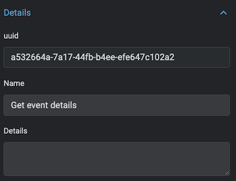

# AutoRemediation for the Lacework Policy LW_S3_7

## Description
Ensure the bucket ACL does not grant AWS users WRITE permission [create, overwrite,
and delete S3 objects].

The S3 bucket ACL gives any authenticated AWS user permission to create, write and delete
objects in the bucket. It is best practice to restrict WRITE permission to only principals who
require it.

**Rationale:**
Granting all AWS users WRITE permission allows any authenticated AWS user to create, write and
delete bucket objects. Malicious users can create temporary AWS accounts and exploit this
permission to alter data, delete data and misuse your resources.

### Severity
Critical

### Control ID
LW_S3_7

### Remediation Steps to manually fix this

Perform the following to revoke WRITE permission for all AWS users:
1. Sign in to the AWS Management Console
2. Open the S3 Service - https://console.aws.amazon.com/s3/
3. From the list of S3 buckets, select the S3 bucket you want to change
4. Navigate to the permissions tab
5. Select Access Control List from the permissions tab
6. Under Public access, Select the Group ‘Any AWS user’ by clicking the circular button in front
of it
7. Uncheck ‘Write objects’ under ‘Access to the objects’
8. Click ‘Save’ to remove the permission for ‘Any AWS user’
9. Repeat steps 3-8 for every bucket for which you want to change permissions

## How can i use this Map for Auto Remediation?

We recommend to create an S3 test bucket and configure it to give all authenticated AWS users WRITE permission. This will generate an event and alert inside Lacework during the next compliance check. This Event can then be used to test the Auto Remediation of this Map.

You can use the following AWS CLI command to configure an existing S3 test bucket to give all authenticated AWS users WRITE permission:

```
aws s3api put-bucket-acl --bucket <YOURBUCKETNAME>  --grant-write uri=http://acs.amazonaws.com/groups/global/AuthenticatedUsers
```
**Note:** Make sure you configure the **YOURBUCKETNAME** with the name of the S3 test bucket you would like to use for tests. Don't use any S3 bucket with important data! This if for testing of this map only and it should not have any important data.

## Import the Map

The Map needs to be imported inside an existing or new Kaholo Project.

### Map Design and workflow
The **LW_S3_7** map currently has the following map design:


* The map starts with **Get the Event details** object. It will use the **event_id** send by the [Webhook payload](https://support.lacework.com/hc/en-us/articles/360034367393-Webhook), using the Lacework API Access Key and  Lacework Secret Key to create a [temporary API token](https://support.lacework.com/hc/en-us/articles/360011403853-Generate-API-Access-Keys-and-Tokens). This token is used to query the Lacework API via the API call **/api/v1/external/events/GetEventDetails** of the configure Lacework instance.
* The map will trigger the **Remediate via CLI** CommandLine object If you enabled the Auto Remediation via the CLI inside the LaceworkConfig of the map by using the **"dotheremediationviacli": "true"** setting. It will print out the name of the S3 buckets that will be remediated and uses the AWS CLI to remediate the S3 buckets.
* The map will trigger the **Remediate via Object** Amazon-aws-s3 object if you enabled the Auto Remediation via the Object inside the LaceworkConfig of the map by using the **"dotheremediationviaobject": "true"** setting. it will remediate all S3 buckets by using the Method **apply canned ACL to Bucket** from the [S3 bucket plugin](https://github.com/Kaholo/kaholo-plugin-amazon-s3).
* The map will send out a Slack message for each S3 bucket that will be remediated to the Webhook you configured for the **Remediated** Slack object.
* If you enabled the configuration to send out slack messages for ignored S3 buckets inside the LaceworkConfig of the Map **"sendslackmessagesforignored": "true"** it will send out a slack message for each bucket that is violating the policy and ignored to the Webhook you configured for the **Ignored** Slack object.

### Map trigger

Make sure that the Map Trigger is configured with the following configuration:


1. The Configuration needs to be configured with **LaceworkConfig**
2. The Plugin needs to be configured with the **kaholo-trigger-lacework**
3. The Method **Lacework Alert** needs to be selected
4. The Variable **Event type** needs to be configured with Value **Compliance**
5. The Variable **Event ID** needs to be configured with Value **LW_S3_7**.
6. The Variable **Event Severity** needs to be configured with the Value **Any** or **High**

This configuration will make sure that this map is only triggered if the **event_description** of the [Webhook payload](https://support.lacework.com/hc/en-us/articles/360034367393-Webhook) includes the **LW_S3_7** Event ID.

### Configuration of the Map

Make sure you configure the following configurations inside the **LaceworkConfig** Configuration of the map:
1. **eventuuid:** Please make sure that the UUID used here is the UUID of the "Get event details". Due to the reimport of the Map the UUID of the event object could have changed. For that you can go to the Design, open the "Get Events" building block.


Inside the configuration of the Get Event building block you will find the UUID:



2. **Note:** you can decide to  do the AutoRemediation via the CLI **"dotheremediationviacli": "true"** or using the Kaholo S3 bucket object **"dotheremediationviaobject": "true"**. By default both settings are configured to **false**, so it will not by accident start to remediate S3 buckets. We recommend to make sure that only the right buckets will be remediated and the map is working as expected before you configure this setting to true. Do not configure **dotheremediationviacli"** and **dotheremediationviaobject"** both to **true**. The Map will check that at the beginning and not execute. Only one of each can be enabled and used for the AutoRemediation.

3. (Optional). You can configure the Map to ignore specific S3 buckets from Auto Remediation. Make sure you configured the correct AWS S3 buckets that should be ignored within the bucketIgnoreList of the LaceworkConfig.

```
{
  "name": "LaceworkConfiguration",
  "policyID": "LW_S3_7",
  "violationdescription": "Ensure the S3 bucket ACL does not grant every authenticated AWS User WRITE permission",
  "eventuuid": "a532664a-7a17-44fb-b4ee-efe647c102a2",
  "dotheremediationviacli": "false",
  "dotheremediationviaobject": "false",
  "sendslackmessagesforignored": "true",
    "bucketIgnoreList":[
        "arn:aws:s3:::mybucket01",
        "arn:aws:s3:::mybucket02",
        "arn:aws:s3:::mybucket03"
    ]
}
```

4. If you are using the AutoRemediation via CLI, make sure you select an Agent for the Map that has the AWS CLI installed and configured.

### Configuration of Slack Messages

For the Slack building block you can configure a Slack Webhook Url that you have to implement inside the Kaholo Vault before you can select it.

It will send out a slack message to the configured Webhook. We recommend to configure it similar to the Webhook you use within Lacework as alert channel.

If you don't have slack or don't need slack messages feel free to simply remove this building block.

Optional you can disable via **"sendslackmessagesforignored": "false"** to not send out slack messages for S3 buckets that are violating the policy but are ignored via the **bucketIgnoreList**. By default this is configured to **true**.

### Configuration of the Remediation

The AutoRemediation is disabled if you import the map. It will only be triggered if the configuration **dotheremediationviacli** or **dotheremediationviaobject** of the LaceworkConfig is configured with **true**. Before enabling this we recommend the following:

1. Create a test S3 bucket that is violating the compliance rule for **LW_S3_7** via the CLI command described in the section ["How can i use the Map?"](https://github.com/automatecloud/lacework-kaholo-autoremediation/tree/main/maps/compliance/aws/LW_S3_7#how-can-i-use-this-map)
2. Make sure that you put all the S3 buckets that should not be auto remediated into the bucketIgnoreList of the LaceworkConfig.
3. To be even more sure we recommend to configure a suppression setting for the LW_S3_6 compliance check within the Lacework platform to ignore the S3 bucket. Otherwise the ignored Buckets will create additional Events and Alerts within Lacework.

If you configure the **dotheremediationviacli** settings to **true** the Remediation via CLI block will Auto Remediate by using the following AWS CLI command that will put the ACL back into private mode, which means only the owner will be able to list and write on Objects and read and write on the Bucket ACL:

```
aws s3api put-bucket-acl --bucket <YOURBUCKETNAME> --acl private
```

If you want to know more about the aws s3api put-bucket-acl command or want to replace it with a different option for auto remediation we recommend to take a look at the official documentation available [here](https://awscli.amazonaws.com/v2/documentation/api/latest/reference/s3api/put-bucket-acl.html).

If you configure the **dotheremediationviacli** to **true** the Remediation via Object block will Auto Remediate by using the Kaholo S3 bucket plugin. For this you need to make sure that the **remediateviaobject** action has the correct configured AWS access key, AWS secret key and the correct AWS region. the S3 bucket name will be created by using the **remediateviaobject** function, and the Canned ACL Type is configured to **Private**

## Build an example curl webhook

There is no need to wait for Lacework sending the Webhook Alert all the time when you want to test the map. If you plan to test it immediately, you can trigger the map by using a simple curl command that will send the necessary information.

Before you can trigger the webhook you need to have an event generated within your Lacework instance.

As soon as you got an event we recommend using the Event Information to create an example webhook trigger inside your terminal using the following environment variables. Make sure to update it with the information from the Event you did generate.#

```
export EVENTTITLE="New Violations"
export EVENTTYPE=Compliance
export EVENTTIMESTAMP="27 Jan 2021 16:00 GMT"
export EVENTSOURCE=AWSCompliance
export EVENTID=11
export EVENTSEVERITY=1
export WEBHOOKURL=https://mykaholoinstance.kaholo.io/webhook/lacework/alert
export LACEWORKINSTANCE=mylaceworkinstance
export EVENTDESCRIPTION="AWS Account 112233445566 (lacework-test) : LW_S3_7 Ensure the S3 bucket ACL does not grant AWS users WRITE permission [create, overwrite, and delete S3 objects]"
```
You need to replace the following before you apply the environment variables:
1. **EVENTID** with the EventID that was generated inside the Lacework environment.
2. **WEBHOOKURL** with your Kaholo Webhook Url. Normally kaholo is listening on port 3000 and the URL path for the webhook alerting is /webhook/lacework/alert.
3. **LACEWORKINSTANCE** your Lacework instance where you created that event.
4. **EVENTDESCRIPTION** replace the AWS Account with your environment specific AWS Account ID.

With that you can trigger the webhook inside kaholo by using the following curl command:

```
curl -X POST -H 'Content-type: application/json' --data '{"event_title": "'"$EVENTTITLE"'", "event_link": "https://'"$LACEWORKINSTANCE"'.lacework.net/ui/investigation/recents/EventDossier-'"$EVENTID"'", "lacework_account": "'"$LACEWORKINSTANCE"'", "event_source": "'"$EVENTSOURCE"'", "event_description":"'"$EVENTDESCRIPTION"'", "event_timestamp":"'"$EVENTTIMESTAMP"'", "event_type": "Compliance", "event_id": "'"$EVENTID"'", "event_severity": "'"$EVENTSEVERITY"'"}' $WEBHOOKURL
```
We recommend to check the Execution Results when you give it a try. With that you make sure it will remediate the right S3 buckets before you enable the auto remediation.
